# Laporan Jobsheet X Algoritma dan Struktur Data

    

Nama : Cindy Laili Larasati

NIM : 2341720038

<b>Praktikum 1</b>

Kode program :

    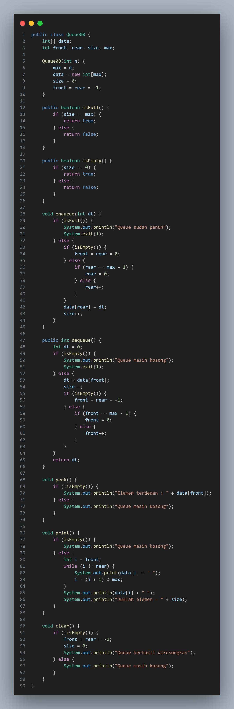
    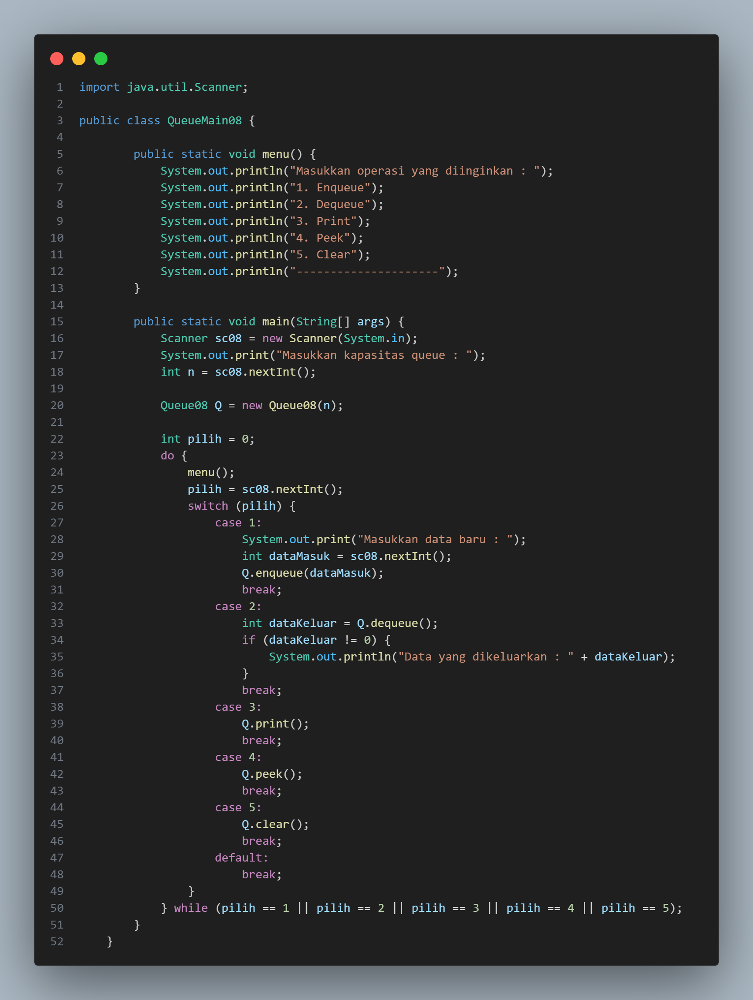

Hasil Program :

    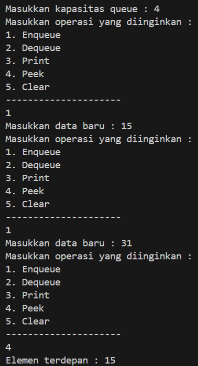

Pertanyaan

1. Pada konstruktor, mengapa nilai awal atribut front dan rear bernilai -1, sementara atribut size
bernilai 0?

jawab : nilai awal atribut front dan rear digunakan untuk menunjukkan bahwa antrian kosong dan ketika kedua atribut memiliki nilai -1 maka tidak ada elemen dalam antrian. sedangkan atribut size ditetapkan sebagai 0 karena saat awal antrian dibuat tidak ada elemen, dan jumlah elemen diwakilin oleh size

2. Pada method Enqueue, jelaskan maksud dan kegunaan dari potongan kode berikut!

if (rear == max - 1)

rear = 0;

jawab : kode tersebut digunakan untuk mengatasi kondisi ketika antrian penuh, jika rear = max 1 maka antriannya penuh. dan kode tersebut mengatur ulang rear ke posisi awal, juga memastikan bahwa elemen baru dapat dimasukkan ke awal antrian jika masih ada ruang yang kososng

3. Pada method Dequeue, jelaskan maksud dan kegunaan dari potongan kode berikut!

if (front == max - 1)

front = 0;

jawab : kode tersebut digunakan untuk mengelola front dalam strutur data circular queue, dan memastikan jika elemen telah diambil, front akan kembali ke posisi awal antrian unutk menangmbil elemen baru

4. Pada method print, mengapa pada proses perulangan variabel i tidak dimulai dari 0 (int i=0),
melainkan int i=front?

jawab : metode print dari struktur data circular queue, memulai perulangan dengan i = front memiliki tujuan dapat mencetak elemen-elemen antrian secara berurutan, dimulai dari posisi pertama dalam antrian.

5. Perhatikan kembali method print, jelaskan maksud dari potongan kode berikut!

i = (i + 1) % max;

jawab : digunakan dalam metode print untuk memperbarui nilai i agar bergerak maju ke elemen berikutnya dalam struktur data circular queue.

6. Tunjukkan potongan kode program yang merupakan queue overflow!

public boolean IsFull() { //queue overflow

        
if (size == max) {

           
 return true;

       
 } else { 

            
return false;

        
}

    
}

7. Pada saat terjadi queue overflow dan queue underflow, program tersebut tetap dapat berjalan
dan hanya menampilkan teks informasi. Lakukan modifikasi program sehingga pada saat terjadi
queue overflow dan queue underflow, program dihentikan!

jawab : 

void enqueue(int dt) { if (isFull()) { System.out.println("Queue sudah penuh"); System.exit(1); } else { if (isEmpty()) { front = rear = 0; } else { if (rear == max - 1) { rear = 0; } else { rear++; } } data[rear] = dt; size++; } }

public int dequeue() { int dt = 0; if (isEmpty()) { System.out.println("Queue masih kosong"); System.exit(1); } else { dt = data[front]; size--; if (isEmpty()) { front = rear = -1; } else { if (front == max - 1) { front = 0; } else { front++; } } } return dt; }

<b>Praktikum 2</b>

Kode program :

    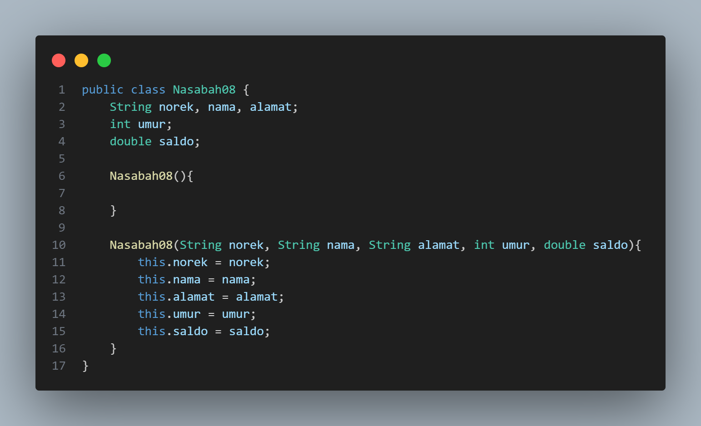
    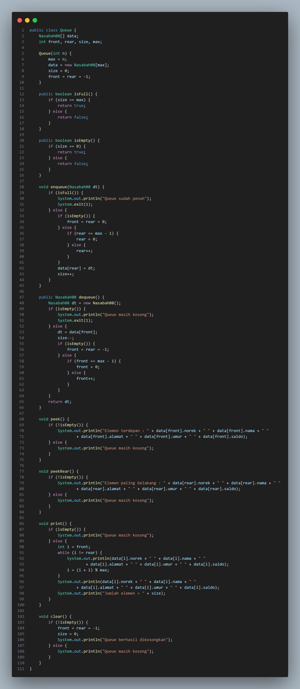
    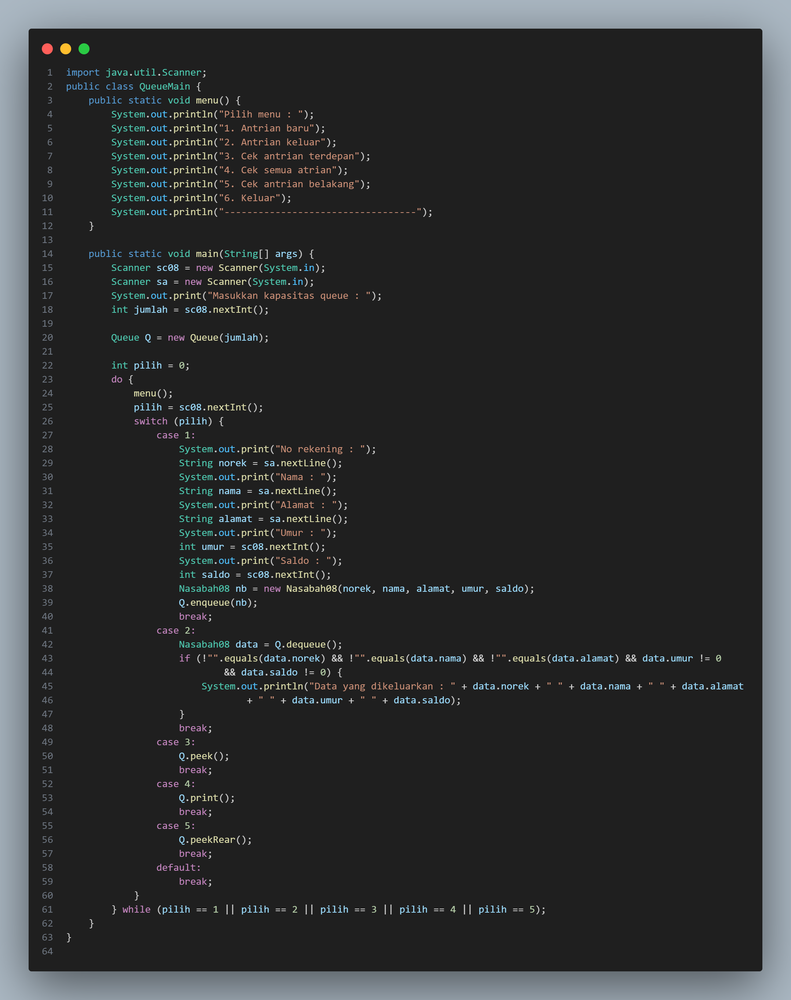

Hasil Program :

    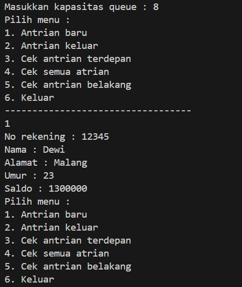
    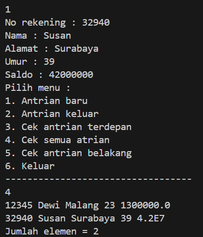

Pertanyaan

1. Pada class QueueMain, jelaskan fungsi IF pada potongan kode program berikut!

    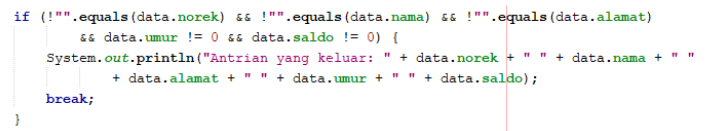

jawab : untuk memeriksa apakah pengambilan elemen dari antrian berhasil dilakukan

2. Lakukan modifikasi program dengan menambahkan method baru bernama peekRear pada class
Queue yang digunakan untuk mengecek antrian yang berada di posisi belakang! Tambahkan pula
daftar menu 5. Cek Antrian paling belakang pada class QueueMain sehingga method peekRear
dapat dipanggil!

jawab :

void peekRear() { if (!isEmpty()) { System.out.println("Elemen terdepan : " + data[rear].norek + " " + data[rear].nama + " " + data[rear].alamat + " " + data[rear].umur + " " + data[rear].saldo); } else { System.out.println("Queue masih kosong"); } }

case 5: System.out.println("5. Cek antrian belakang");

<b>Tugas</b>

1. Buatlah program antrian untuk mengilustasikan pesanan disebuah warung. Ketika seorang pembeli akan mengantri, maka dia harus mendaftarkan nama, dan nomor HP seperti yang digambarkan pada Class diagram

Kode program :

    
    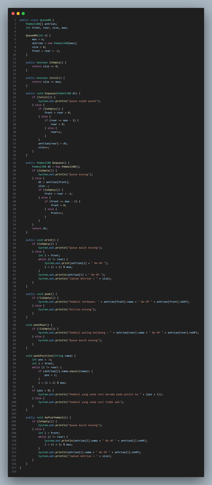
    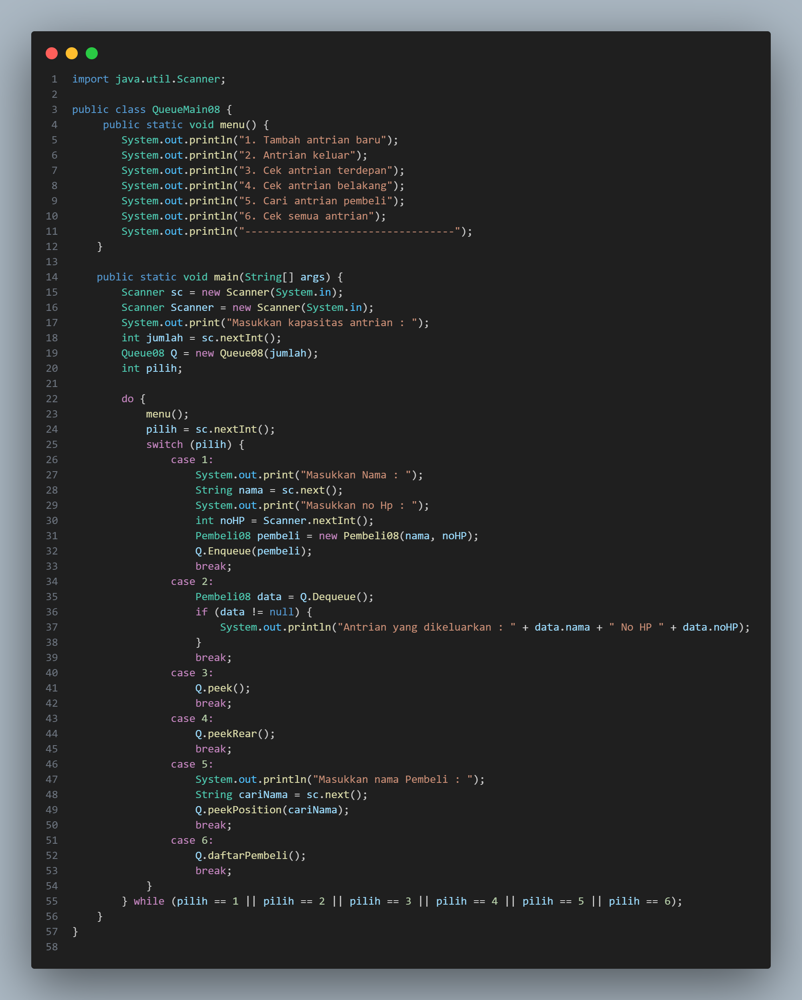

Hasil Program :

    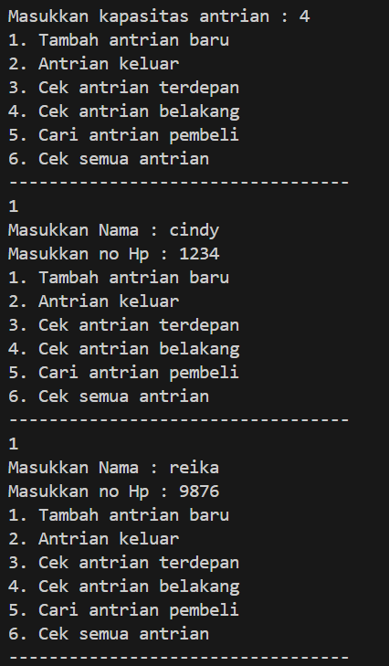
    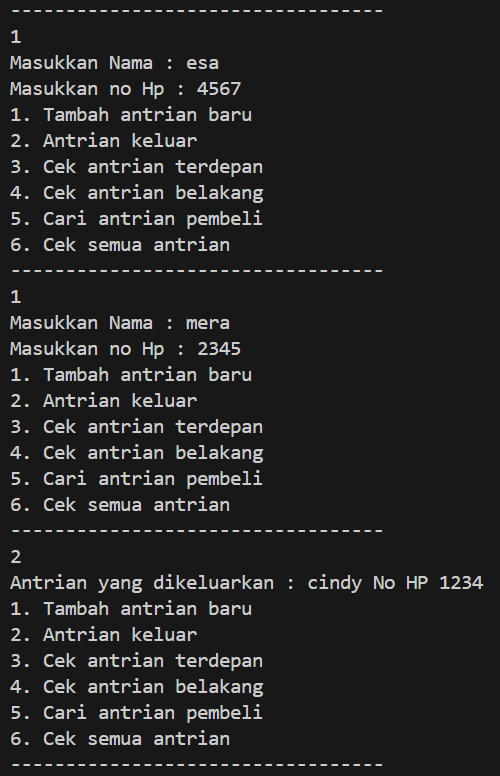
    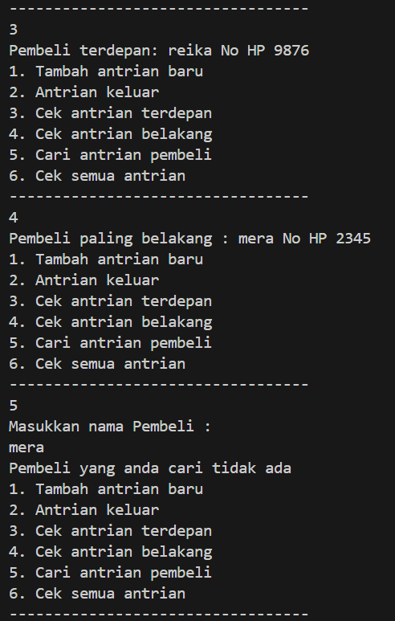
    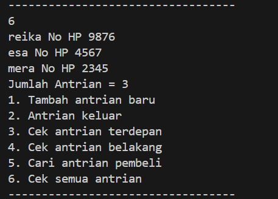

