# Laporan Jobsheet XI Algoritma dan Struktur Data

    

Nama : Cindy Laili Larasati

NIM : 2341720038

<b>Praktikum 1</b>

Kode program :

    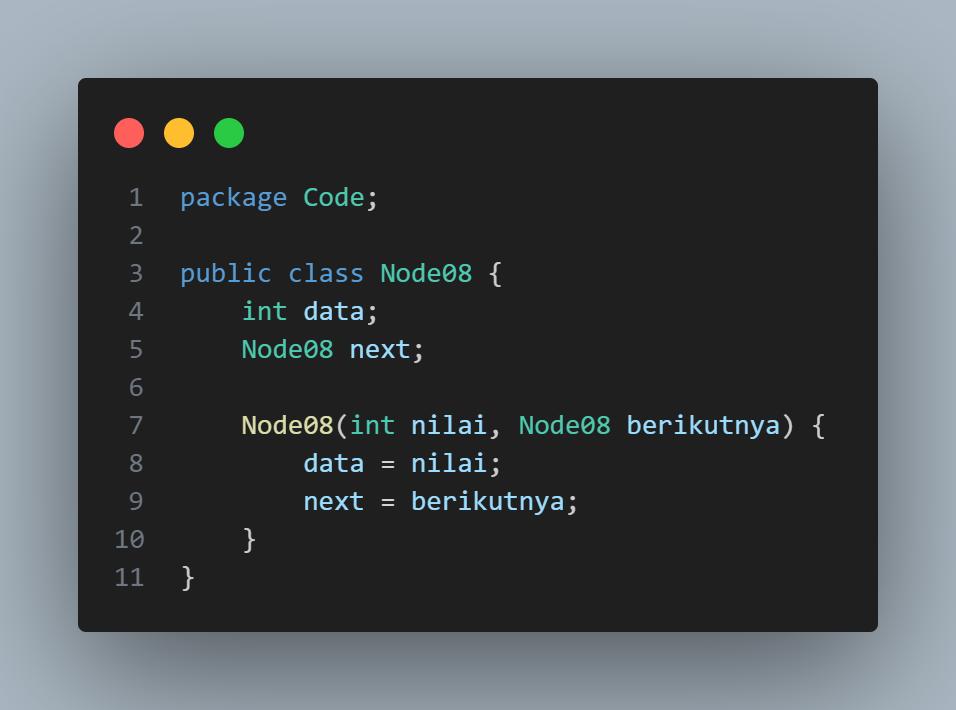
    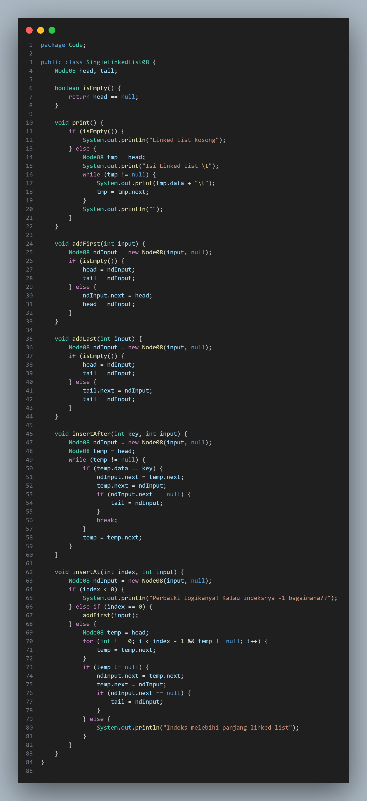
    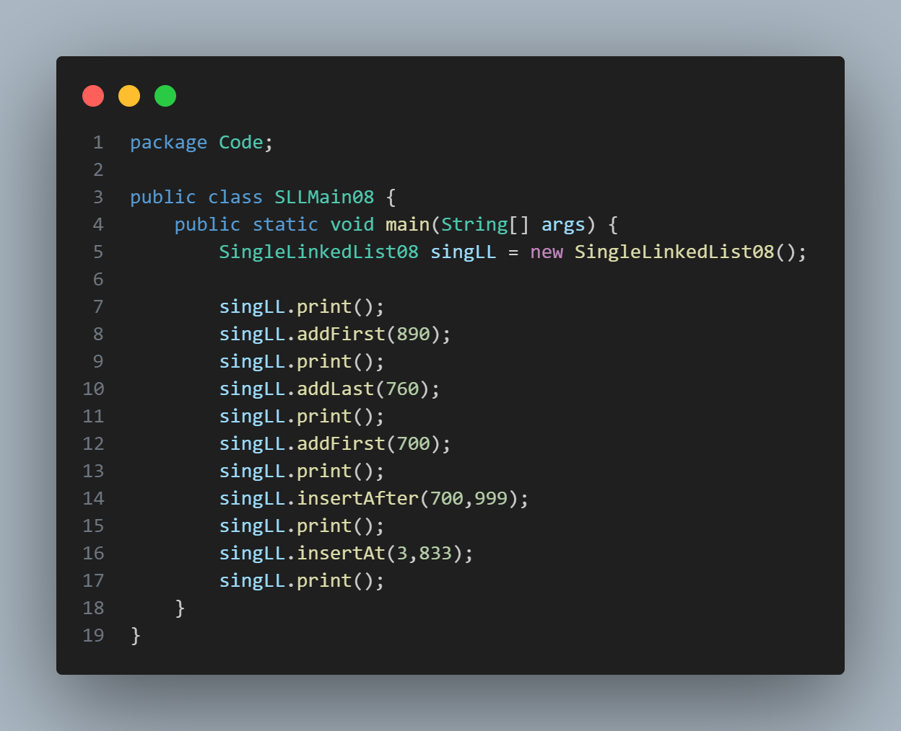

Hasil Program :

    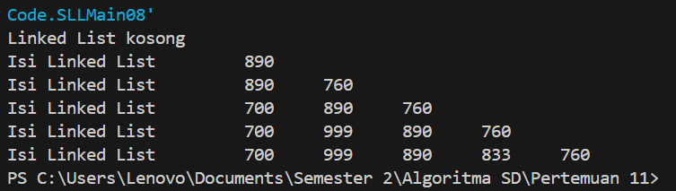 

Pertanyaan

1. Mengapa hasil compile kode program di baris pertama menghasilkan “Linked List Kosong”?

jawab : karena kode tersebut menghasilkan "Linked List Kosong" karena kondisi di metode print() adalah if (isEmpty()), yang mengembalikan true jika head bernilai null

2. Jelaskan kegunaan variable temp secara umum pada setiap method!

jawab : Variabel temp digunakan sebagai pointer untuk menelusuri linked list, variabel temp biasanya dimulai dari head dan kemudian dipindahkan ke node berikutnya hingga mencapai node yang diinginkan

3. Perhatikan class SingleLinkedList, pada method insertAt Jelaskan kegunaan kode berikut

if (temp.next.next==null) tail= temp.next;

jawab : Kode tersebut digunakan untuk menyisipkan node baru ke dalam linked list pada posisi tertentu (ditentukan oleh index). kode ini mengganti referensi temp.next dengan node baru (new Node08(input, temp.next))

<b>Praktikum 1</b>

Kode program :

    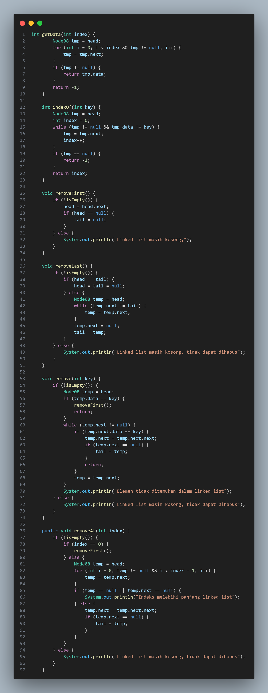
    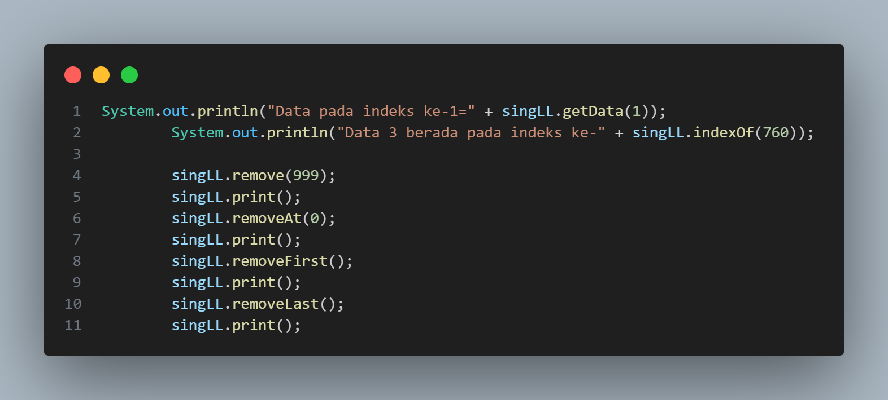

Hasil Program :

    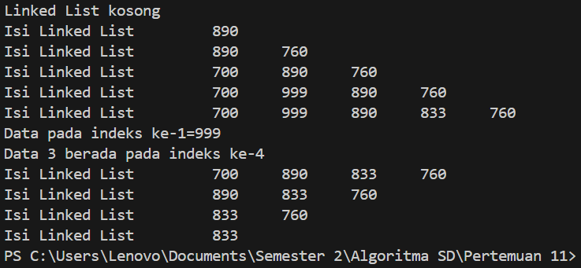

Pertanyaan

1. Mengapa digunakan keyword break pada fungsi remove? Jelaskan!

jawab : digunakan dalam fungsi remove(int key) untuk menghentikan iterasi saat elemen yang ingin dihapus ditemukan.

2. Jelaskan kegunaan kode dibawah pada method remove

else if (temp.next.data == key)

temp.next = temp.next.next;

Kode temp.next = temp.next.next; digunakan untuk menghapus elemen setelah elemen yang ditunjuk oleh temp

<b>Tugas</b>

1. Implementasikan ilustrasi Linked List Berikut. Gunakan 4 macam penambahan data yang telah
dipelajari sebelumnya untuk menginputkan data.

Kode Program

    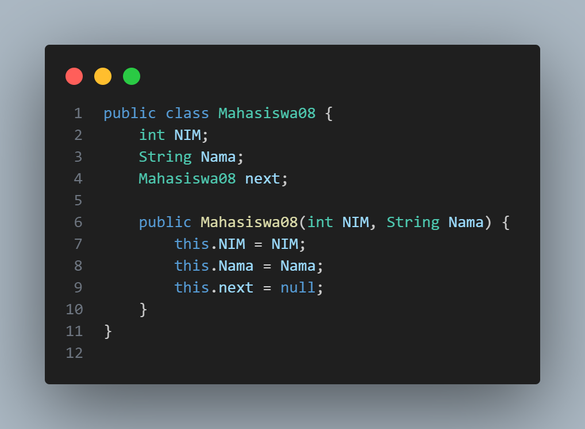
    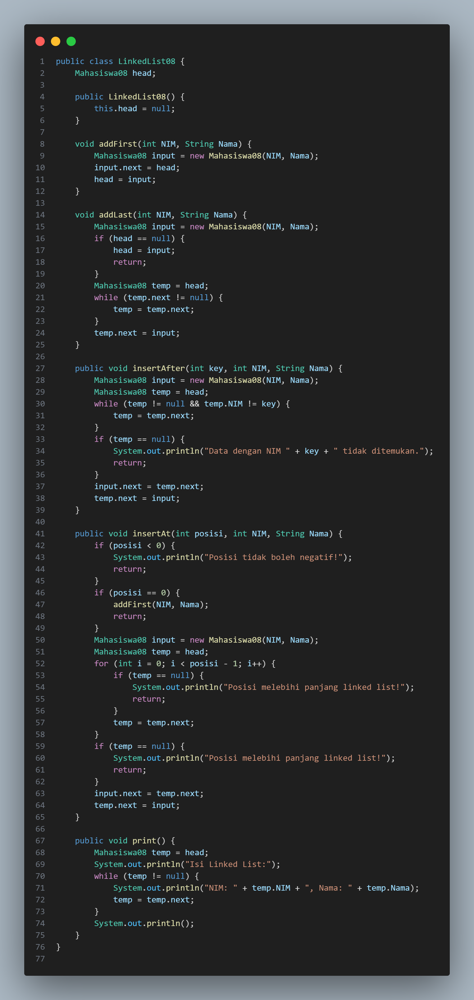
    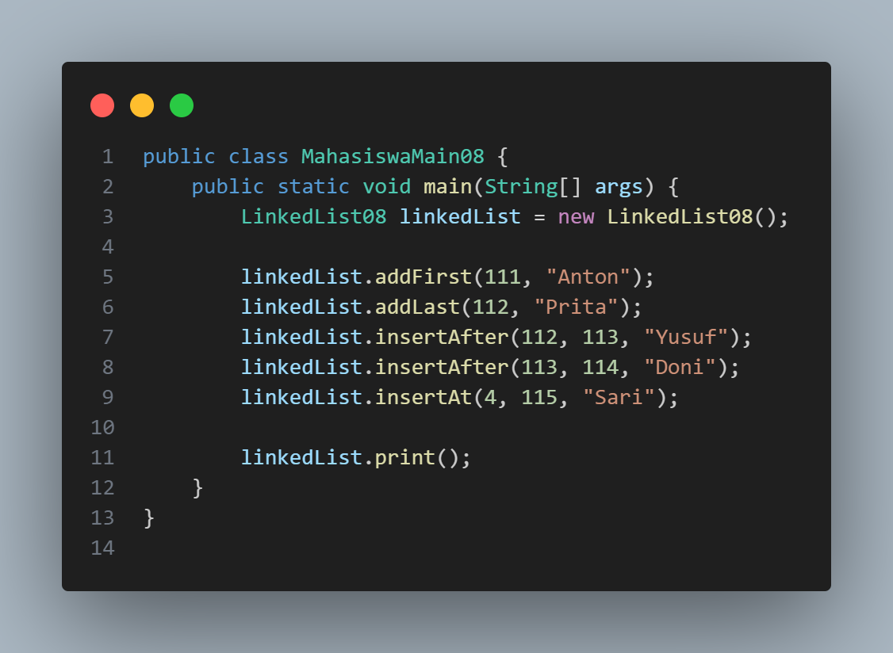

Hasil Program

    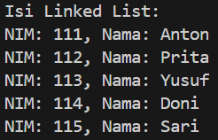

2. Buatlah implementasi program antrian layanan unit kemahasiswaan sesuai dengan kondisi yang
ditunjukkan pada soal nomor 1! Ketentuan

a. Implementasi antrian menggunakan Queue berbasis Linked List!

b. Program merupakan proyek baru, bukan modifikasi dari soal nomor 1!

Kode Program

    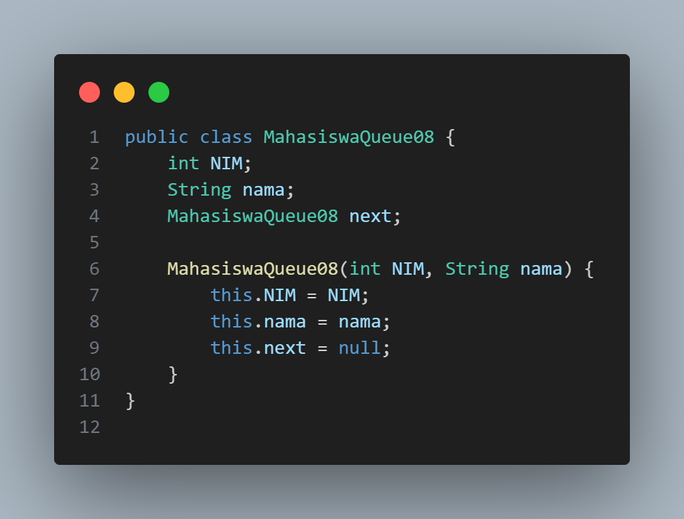
    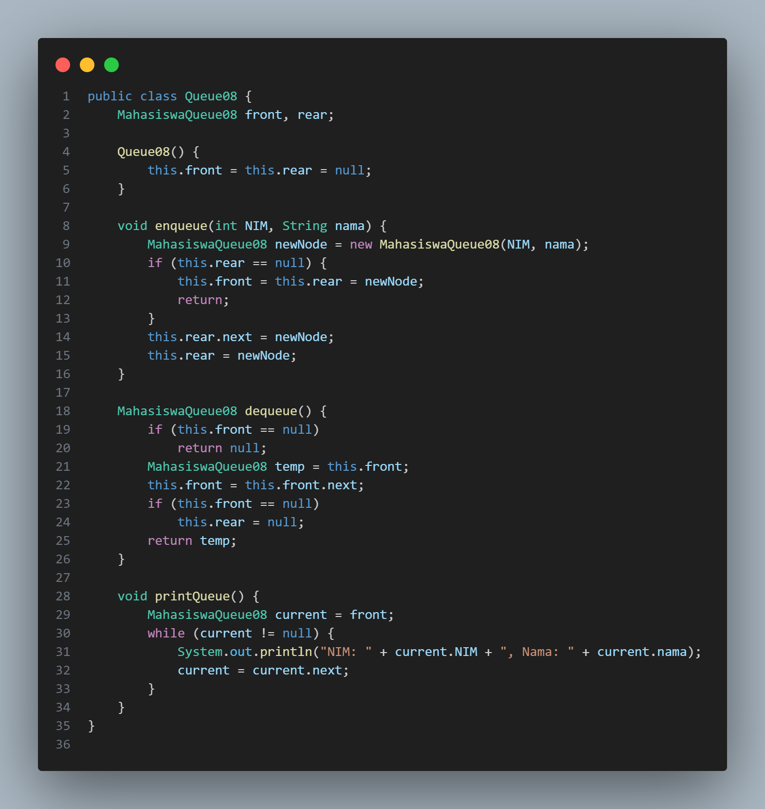
    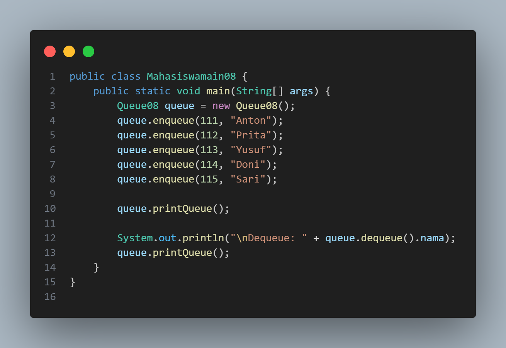

Hasil Program

    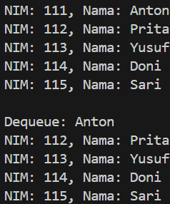

