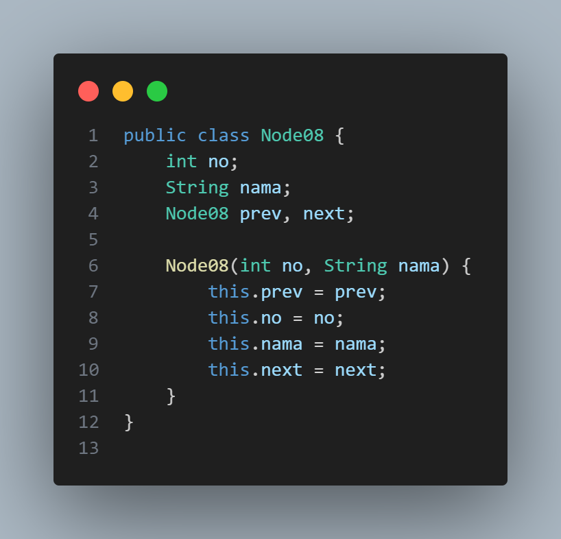
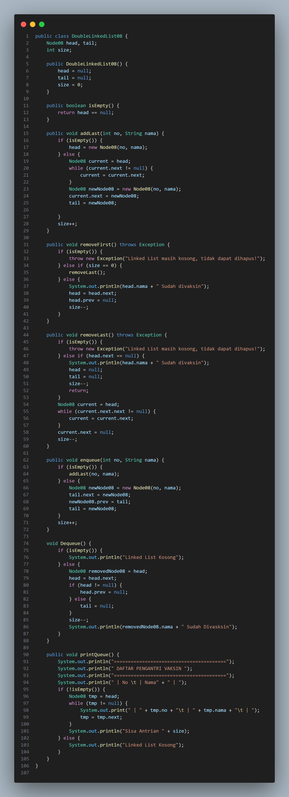
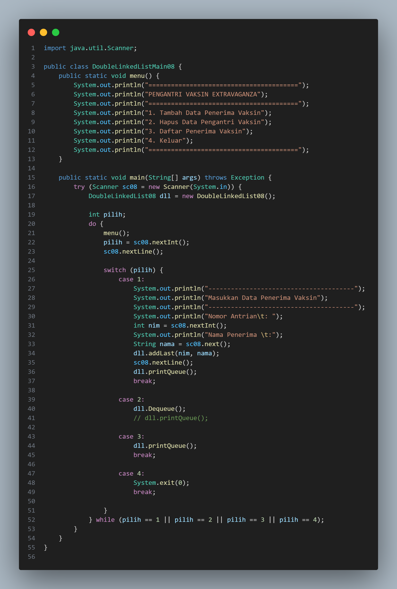

# Laporan Jobsheet XII Algoritma dan Struktur Data

    

Nama : Cindy Laili Larasati

NIM : 2341720038

<b>Praktikum 1</b>

Kode program :

    
    
    

Hasil Program :

    

Pertanyaan

1. Jelaskan perbedaan antara single linked list dengan double linked lists!

jawab : Single Linked List setiap node memiliki satu referensi ke node berikutnya. Sedangkan double Linked List setiap node memiliki dua referensi, yaitu ke node sebelumnya (prev) dan ke node berikutnya (next).

2. Perhatikan class Node, di dalamnya terdapat atribut next dan prev. Untuk apakah atribut
tersebut?

jawab : Atribut next berfungsi untuk menunjuk ke node berikutnya dalam urutan daftar. Sedangkan
Atribut prev berfungsi untuk menunjuk ke node sebelumnya dalam urutan daftar.

3. Perhatikan konstruktor pada class DoubleLinkedLists. Apa kegunaan inisialisasi atribut head dan
size seperti pada gambar berikut ini?

public DoubleLinkedList() {

        
head = null;

        
size = 0;

    
}

jawab : Konstruktor pada kelas DoubleLinkedLists digunakan untuk menginisialisasi atribut head dan size. Inisialisasi head ke null menandakan bahwa linked list awalnya kosong, sedangkan inisialisasi size ke 0 menunjukkan bahwa jumlah elemen dalam linked list awalnya adalah nol

4. Pada method addFirst(), kenapa dalam pembuatan object dari konstruktor class Node prev
dianggap sama dengan null?

Node newNode = new Node(null, item, head);

jawab : Dalam method addFirst(), saat membuat objek dari konstruktor kelas Node, atribut prev diatur ke null karena node yang ditambahkan adalah node pertama dalam linked list

5. Perhatikan pada method addFirst(). Apakah arti statement head.prev = newNode ?

jawab : head.prev = newNode dalam method addFirst() menunjukkan node baru yang ditambahkan sebagai node pertama harus menunjuk ke node sebelumnya, yang sebelumnya adalah nul

6. Perhatikan isi method addLast(), apa arti dari pembuatan object Node dengan mengisikan
parameter prev dengan current, dan next dengan null?

Node newNode = new Node(current, item, null);

jawab: method addLast(), membuat objek Node dengan mengatur parameter prev ke current dan next ke null mengindikasikan bahwa node baru yang ditambahkan akan menjadi node terakhir dalam linked list

7. Pada method add(), terdapat potongan kode program sebagai berikut:

    

jelaskan maksud dari bagian yang ditandai dengan kotak kuning

jawab : untuk menangani kasus ketika elemen ditambahkan di posisi pertama (indeks 0). Jika current.prev adalah null, ini menunjukkan bahwa node baru akan menjadi node pertama dalam linked list

<b>Praktikum 2</b>

Kode program :

    
    

Hasil Program :

    

Pertanyaan

1. Apakah maksud statement berikut pada method removeFirst()?

head = head.next;

head.prev = null;

jawab : method removeFirst(), statement head = head.next; bertujuan untuk menggeser referensi head ke node berikutnya setelah node pertama dihapus. Sedangkan head.prev = null; mengatur referensi prev dari node baru yang menjadi node pertama menjadi null, karena node baru tersebut tidak memiliki node sebelumnya

2. Bagaimana cara mendeteksi posisi data ada pada bagian akhir pada method removeLast()?

jawab : dalam method removeLast(), perlu melakukan pengecekan apakah node terakhir memiliki referensi next yang kosong (null). Jika current.next == null, ini menunjukkan bahwa node saat ini adalah node terakhir dalam linked list

3. Jelaskan alasan potongan kode program di bawah ini tidak cocok untuk perintah remove!

    

jawab : untuk menghapus suatu node dari struktur data linked list ganda (doubly linked list)

4. Jelaskan fungsi kode program berikut ini pada fungsi remove!

    

jawab : 

 - current.prev.next = current.next; dan current.next.prev = current.prev; berfungsi untuk menghapus node current dari linked list

 - current.prev.next = current.next; mengatur referensi next dari node sebelum current agar menunjuk ke node setelah curren

 - current.next.prev = current.prev; mengatur referensi prev dari node setelah current agar menunjuk ke node sebelum current

<b>Praktikum 3</b>

Kode program :

    
    

Hasil Program :

    
    

Pertanyaan

1. Jelaskan method size() pada class DoubleLinkedLists!

jawab : method mengembalikan jumlah elemen (node) yang ada dalam linked list. Pada implementasinya, method ini mengakses atribut size yang menyimpan informasi tentang jumlah elemen dalam linked list, kemudian mengembalikan nilai size tersebut

2. Jelaskan cara mengatur indeks pada double linked lists supaya dapat dimulai dari indeks ke1!

jawab : untuk nilai awal indeks ke-1 dan kemudian menyesuaikan operasi-operasi yang dilakukan pada linked list, seperti penambahan, penghapusan, atau pencarian elemen, untuk memperhitungkan pergeseran indeks.

3. Jelaskan perbedaan karakteristik fungsi Add pada Double Linked Lists dan Single Linked Lists!

jawab : 

 - Double Linked Lists (DLL) : Pada DLL, penambahan elemen baru dapat dilakukan di kedua ujung linked list (pertama atau terakhir), serta di tengah-tengah linked list 

 - Single Linked Lists (SLL) : Pada SLL, penambahan elemen baru terbatas pada ujung-ujung linked list (pertama atau terakhir)

4. Jelaskan perbedaan logika dari kedua kode program di bawah ini!

    

jawab : memeriksa apakah suatu struktur data (seperti linked list) kosong, tetapi mereka melakukannya dengan cara yang berbeda dan bergantung pada atribut yang berbeda

<b>Tugas</b>

1. Buat program antrian vaksinasi menggunakan queue berbasis double linked list sesuai ilustrasi 
dan menu di bawah ini! (counter jumlah antrian tersisa di menu cetak(3) dan data orang yang 
telah divaksinasi di menu Hapus Data(2) harus ada)

    
    
    

2. Buatlah program daftar film yang terdiri dari id, judul dan rating menggunakan double linked 
lists, bentuk program memiliki fitur pencarian melalui ID Film dan pengurutan Rating secara 
descending. Class Film wajib diimplementasikan dalam soal ini. 
