# Laporan Jobsheet XII Algoritma dan Struktur Data

    

Nama : Cindy Laili Larasati

NIM : 2341720038

<b>Praktikum 1</b>

Kode program :

    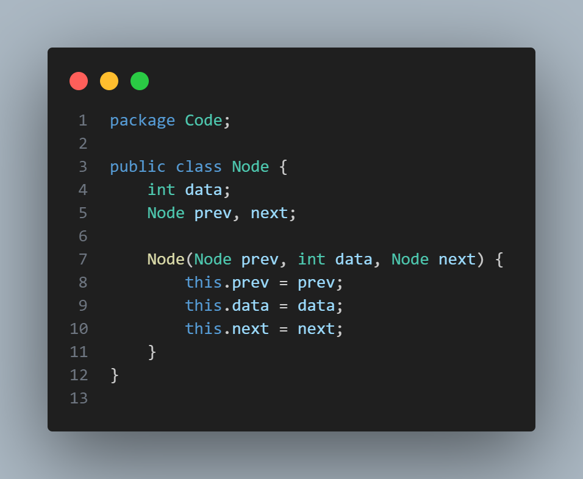
    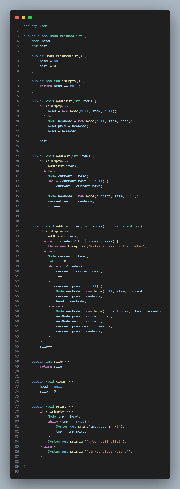
    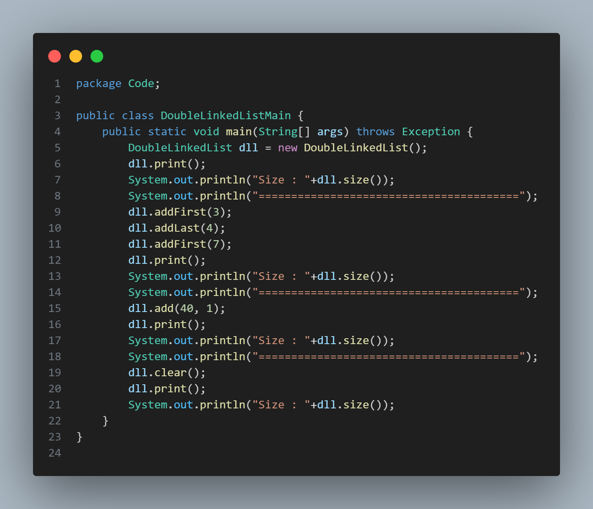

Hasil Program :

    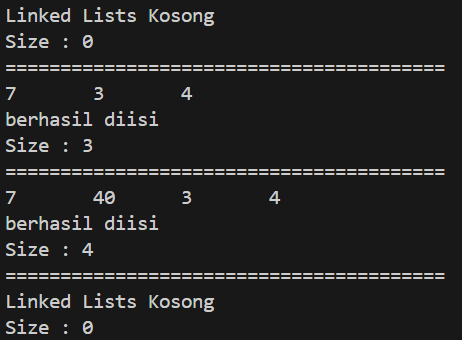

Pertanyaan

1. Jelaskan perbedaan antara single linked list dengan double linked lists!

jawab :

2. Perhatikan class Node, di dalamnya terdapat atribut next dan prev. Untuk apakah atribut
tersebut?

jawab :

3. Perhatikan konstruktor pada class DoubleLinkedLists. Apa kegunaan inisialisasi atribut head dan
size seperti pada gambar berikut ini?

public DoubleLinkedList() {

        
head = null;

        
size = 0;

    
}

jawab :

4. Pada method addFirst(), kenapa dalam pembuatan object dari konstruktor class Node prev
dianggap sama dengan null?

Node newNode = new Node(null, item, head);

jawab :

5. Perhatikan pada method addFirst(). Apakah arti statement head.prev = newNode ?

jawab :

6. Perhatikan isi method addLast(), apa arti dari pembuatan object Node dengan mengisikan
parameter prev dengan current, dan next dengan null?

Node newNode = new Node(current, item, null);

jawab: 

7. Pada method add(), terdapat potongan kode program sebagai berikut:

    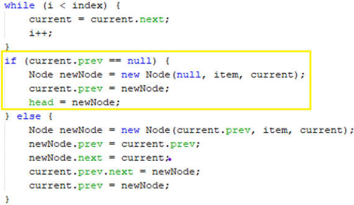

jelaskan maksud dari bagian yang ditandai dengan kotak kuning

jawab :

<b>Praktikum 2</b>

Kode program :

    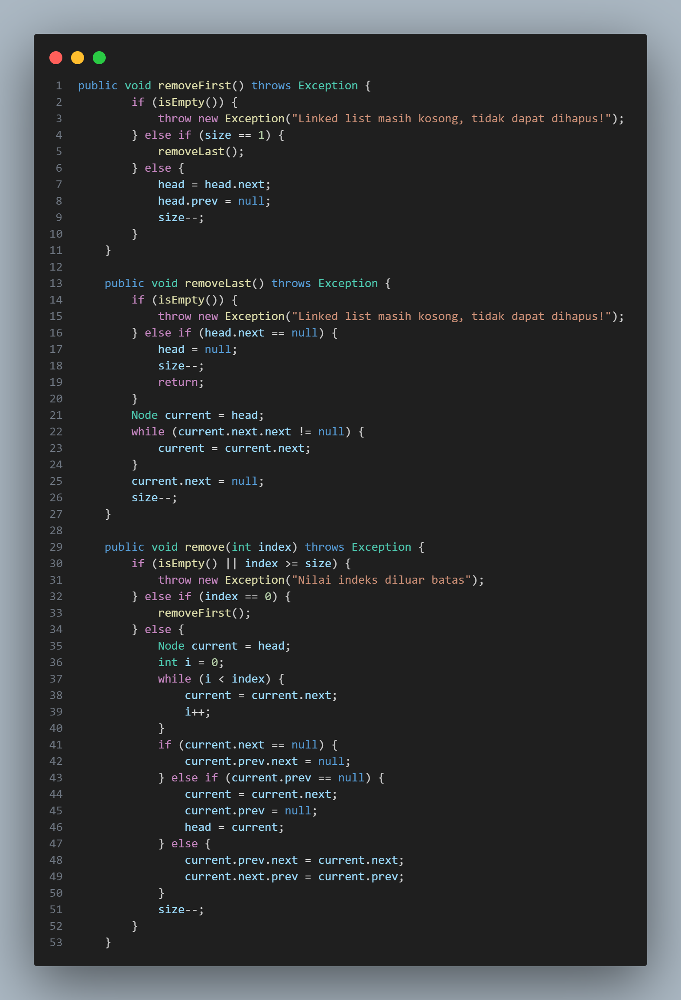
    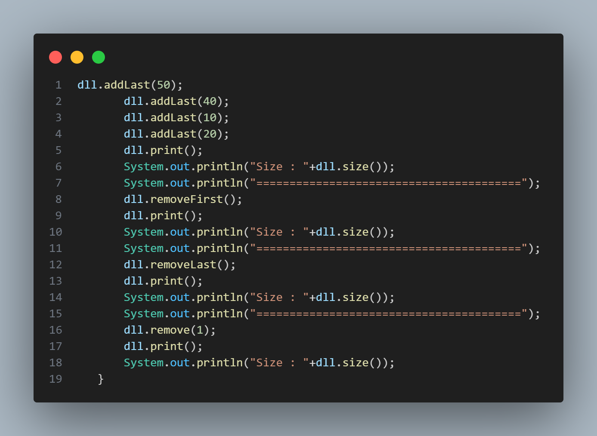

Hasil Program :

    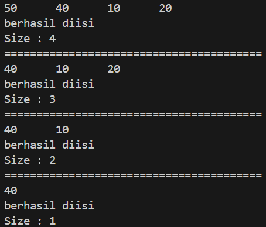

Pertanyaan

1. Apakah maksud statement berikut pada method removeFirst()?

head = head.next;

head.prev = null;

jawab :

2. Bagaimana cara mendeteksi posisi data ada pada bagian akhir pada method removeLast()?

jawab :

3. Jelaskan alasan potongan kode program di bawah ini tidak cocok untuk perintah remove!

    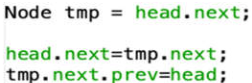

jawab :

4. Jelaskan fungsi kode program berikut ini pada fungsi remove!

    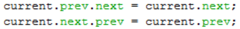

jawab :

<b>Praktikum 3</b>

Kode program :

    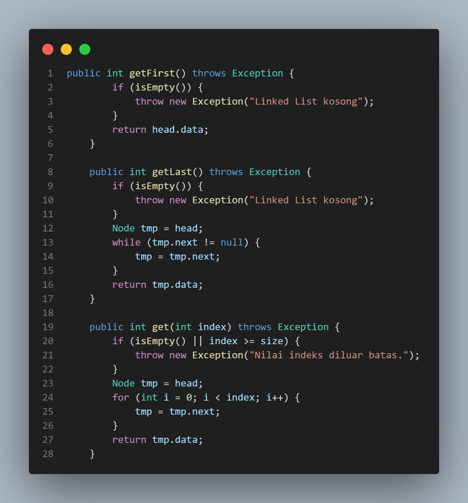
    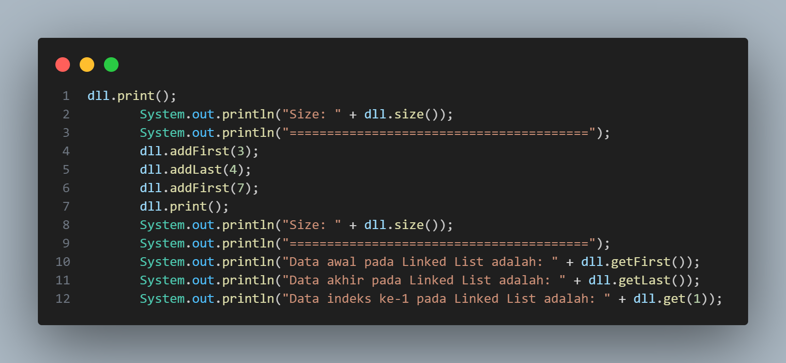

Hasil Program :

    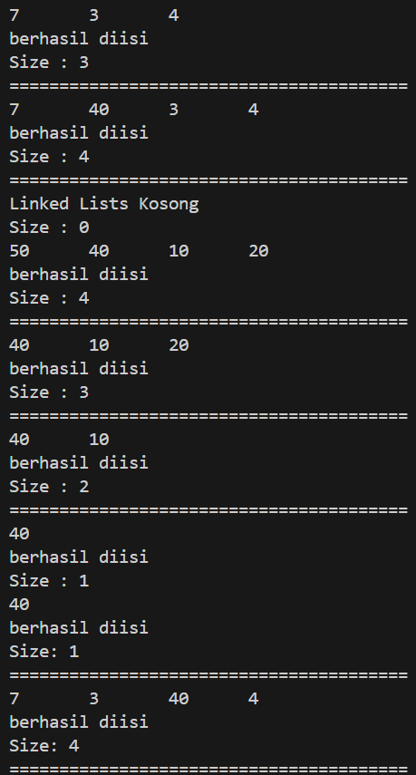
    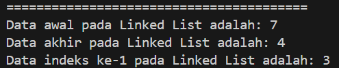

Pertanyaan

1. Jelaskan method size() pada class DoubleLinkedLists!

2. Jelaskan cara mengatur indeks pada double linked lists supaya dapat dimulai dari indeks ke1!

3. Jelaskan perbedaan karakteristik fungsi Add pada Double Linked Lists dan Single Linked Lists!

4. Jelaskan perbedaan logika dari kedua kode program di bawah ini!

    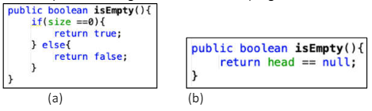

<b>Tugas</b>

1. Buat program antrian vaksinasi menggunakan queue berbasis double linked list sesuai ilustrasi 
dan menu di bawah ini! (counter jumlah antrian tersisa di menu cetak(3) dan data orang yang 
telah divaksinasi di menu Hapus Data(2) harus ada)

2. Buatlah program daftar film yang terdiri dari id, judul dan rating menggunakan double linked 
lists, bentuk program memiliki fitur pencarian melalui ID Film dan pengurutan Rating secara 
descending. Class Film wajib diimplementasikan dalam soal ini. 
