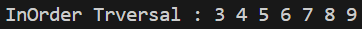

# Laporan Jobsheet XIII Algoritma dan Struktur Data

    

Nama : Cindy Laili Larasati

NIM : 2341720038

<b>Praktikum 1</b>

Kode program :

    
    
    

Hasil Program :

    

Pertanyaan

1. Mengapa dalam binary search tree proses pencarian data bisa lebih efektif dilakukan dibanding
binary tree biasa?

jawab : arena setiap node memiliki nilai yang terorganisir, di mana nilai di subtree kiri lebih kecil dan nilai di subtree kanan lebih besar. Hal ini memungkinkan pencarian menggunakan metode pencarian biner, di mana pencarian hanya perlu dilakukan pada satu sisi subtree tergantung pada perbandingan nilai dengan node saat ini.

2. Untuk apakah di class Node, kegunaan dari atribut left dan right?

jawab : pada struktur pohon biner, atribut left dan right digunakan untuk menunjukkan node anak kiri dan node anak kanan dari node saat ini, secara berurutan

3. a. Untuk apakah kegunaan dari atribut root di dalam class BinaryTree?

jawab : digunakan untuk menunjukkan akar (root) dari pohon biner. Root adalah node pertama dari pohon biner, dan semua node lainnya diakses melalui root

b. Ketika objek tree pertama kali dibuat, apakah nilai dari root?

jawab : Ketika objek tree pertama kali dibuat, nilai dari root akan null, karena pada awalnya pohon tersebut belum memiliki node apa pun

4. Ketika tree masih kosong, dan akan ditambahkan sebuah node baru, proses apa yang akan terjadi?

jawab : node baru akan menjadi root dari pohon, dan nilai dari root akan ditetapkan sebagai node baru yang akan ditambahkan

5. Perhatikan method add(), di dalamnya terdapat baris program seperti di bawah ini. Jelaskan
secara detil untuk apa baris program tersebut?

 
if(data<current.data){

 
if(current.left!=null){

 
current = current.left;

 
}else{

 
current.left = new Node(data);

 
break;

 
}

}

jawab : Baris program tersebut bertanggung jawab untuk menambahkan node baru ke dalam pohon biner. Pada setiap langkah, algoritma menelusuri pohon berdasarkan nilai data yang akan ditambahkan, membandingkannya dengan nilai node saat ini. Jika nilai data kurang dari nilai node saat ini, maka algoritma bergerak ke anak kiri dari node saat ini. Jika node anak kiri sudah ada, algoritma memperbarui node saat ini menjadi anak kiri dan melanjutkan pencarian. Jika node anak kiri belum ada, algoritma menambahkan node baru sebagai anak kiri dari node saat ini dan menghentikan proses

<b>Praktikum 2</b>

Kode program :

    
    

Hasil Program :

    

Pertanyaan

1. Apakah kegunaan dari atribut data dan idxLast yang ada di class BinaryTreeArray?

jawab : 

- Atribut data digunakan untuk menyimpan nilai-nilai yang mewakili node-node dalam pohon biner yang diimplementasikan sebagai array

- Atribut idxLast digunakan untuk menyimpan indeks terakhir dari array data yang berisi data aktual dalam pohon biner

2. Apakah kegunaan dari method populateData()?

jawab : digunakan untuk mengisi array data dalam objek BinaryTreeArray dengan nilai-nilai yang diberikan

3. Apakah kegunaan dari method traverseInOrder()?

jawab : digunakan untuk melakukan traversal inorder pada pohon biner yang direpresentasikan dalam bentuk array, dimulai dari indeks idxStart. Traversal inorder mengunjungi node-node dalam pohon secara berurutan mulai dari node kiri, kemudian node saat ini, dan terakhir node kanan

4. Jika suatu node binary tree disimpan dalam array indeks 2, maka di indeks berapakah posisi
left child dan rigth child masin-masing?

jawab : 

- Left child: 2 * 2 + 1 = 5

Right child: 2 * 2 + 2 = 6

5. Apa kegunaan statement int idxLast = 6 pada praktikum 2 percobaan nomor 4?

jawab : digunakan untuk menunjukkan bahwa indeks terakhir dari data yang valid dalam array adalah 6

<b>Tugas</b>

1. Buat method di dalam class BinaryTree yang akan menambahkan node dengan cara
rekursif.

    

2. Buat method di dalam class BinaryTree untuk menampilkan nilai paling kecil dan yang
paling besar yang ada di dalam tree.

    

3. Buat method di dalam class BinaryTree untuk menampilkan data yang ada di leaf.

    

4. Buat method di dalam class BinaryTree untuk menampilkan berapa jumlah leaf yang ada
di dalam tree.

    

5. Modifikasi class BinaryTreeArray, dan tambahkan :

• method add(int data) untuk memasukan data ke dalam tree

• method traversePreOrder() dan traversePostOrder()

    

