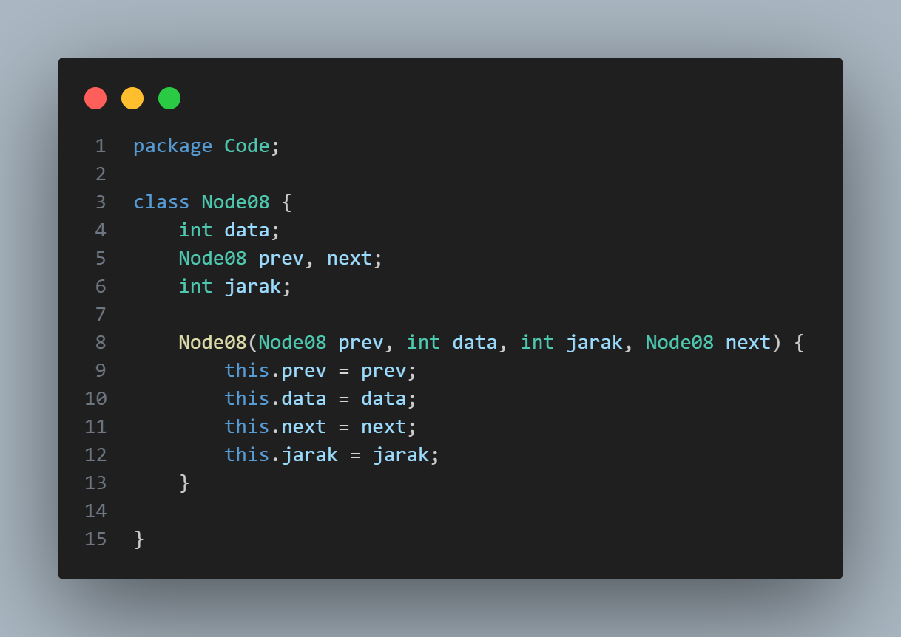
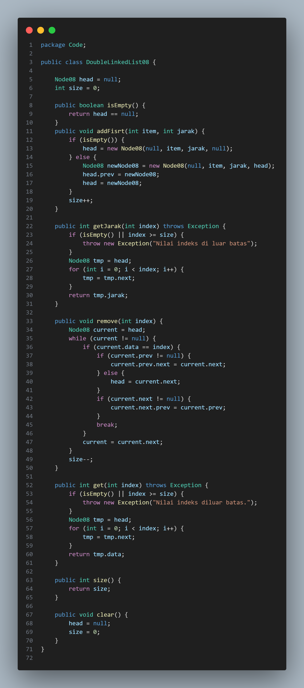
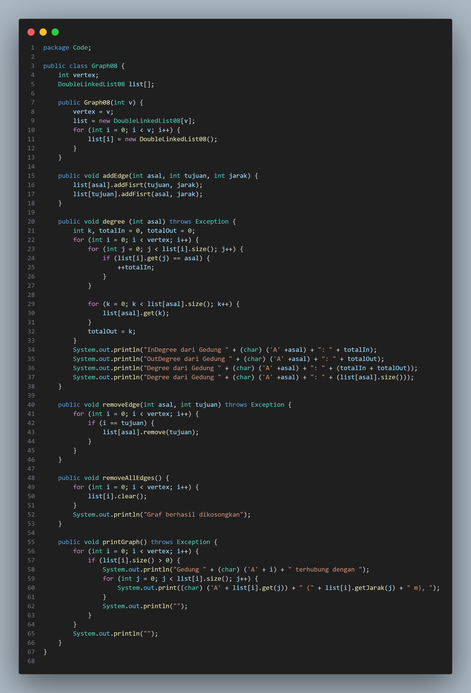
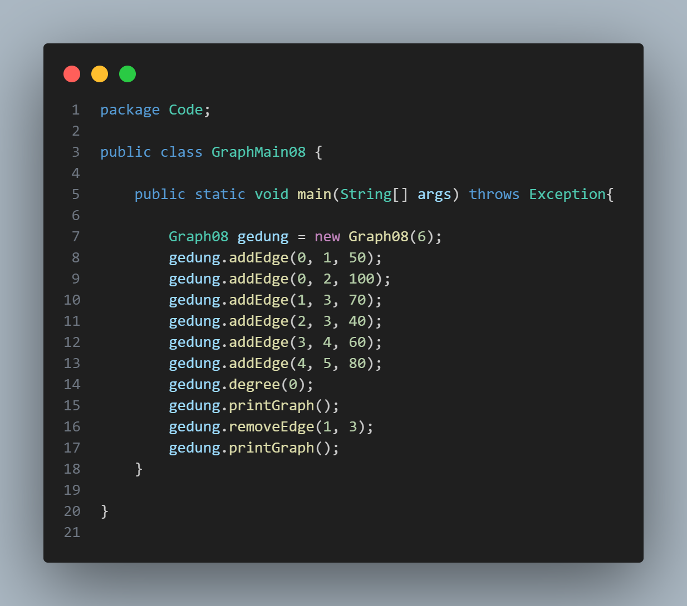
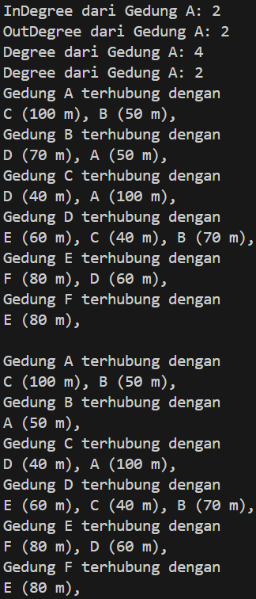
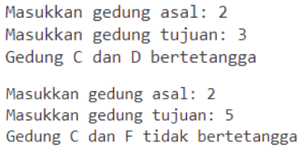
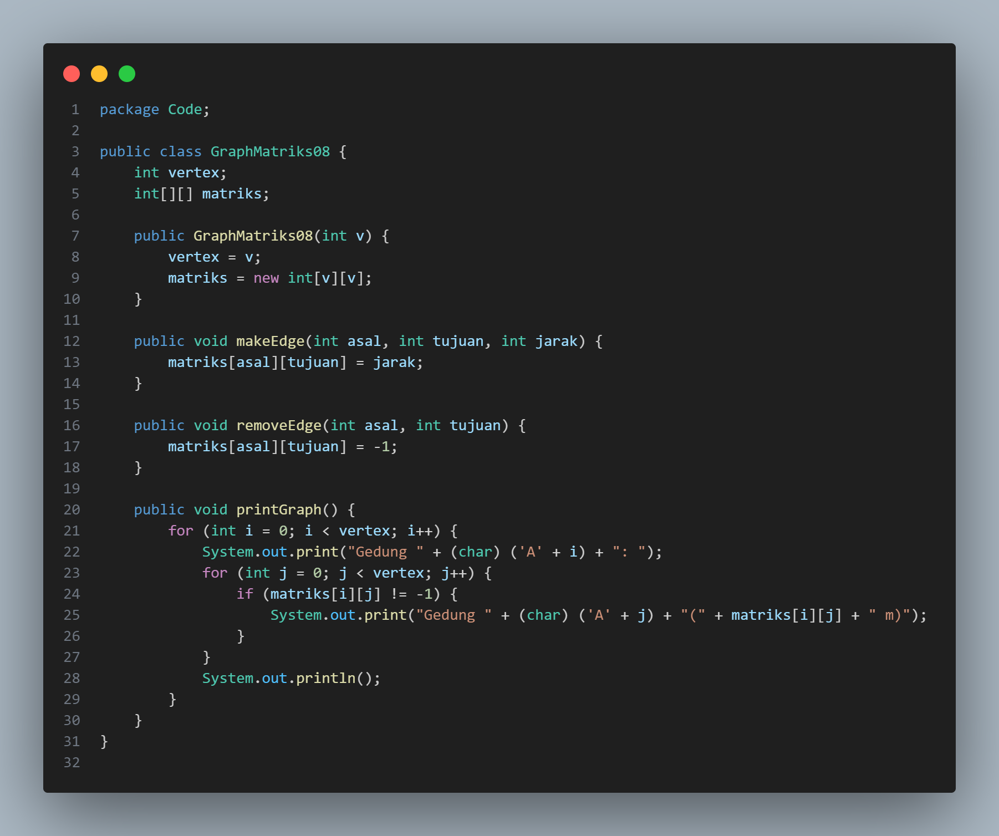
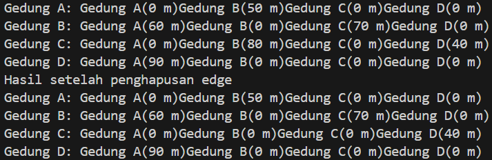
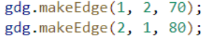

# Laporan Jobsheet XV Algoritma dan Struktur Data

    

Nama : Cindy Laili Larasati

NIM : 2341720038

<b>Praktikum 1</b>

Kode program :

    
    
    
    

Hasil Program :

    

Pertanyaan

1. Perbaiki kode program Anda apabila terdapat error atau hasil kompilasi kode tidak sesuai!

jawab : 

2. Pada class Graph, terdapat atribut list[] bertipe DoubleLinkedList. Sebutkan tujuan pembuatan
variabel tersebut!

jawab : 

3. Jelaskan alur kerja dari method removeEdge!

jawab : 

4. Apakah alasan pemanggilan method addFirst() untuk menambahkan data, bukan method add
jenis lain saat digunakan pada method addEdge pada class Graph?

jawab : 

5. Modifikasi kode program sehingga dapat dilakukan pengecekan apakah terdapat jalur antara
suatu node dengan node lainnya, seperti contoh berikut (Anda dapat memanfaatkan Scanner).

    

jawab : 

<b>Praktikum 2</b>

Kode program :

    
    

Hasil Program :

    

Pertanyaan

1. Perbaiki kode program Anda apabila terdapat error atau hasil kompilasi kode tidak sesuai!

jawab : 

2. Apa jenis graph yang digunakan pada Percobaan 2?

jawab : 

3. Apa maksud dari dua baris kode berikut?

    

jawab : 

4. Modifikasi kode program sehingga terdapat method untuk menghitung degree, termasuk
inDegree dan outDegree!

jawab : 

<b>Latihan</b>

1. Modifikasi kode program pada class GraphMain sehingga terdapat menu program yang bersifat
dinamis, setidaknya terdiri dari:

a. Add Edge

b. Remove Edge

c. Degree

d. Print Graph

e. Cek Edge

Pengguna dapat memilih menu program melalui input Scanner

2. Tambahkan method updateJarak pada Percobaan 1 yang digunakan untuk mengubah jarak
antara dua node asal dan tujuan!

3. Tambahkan method hitungEdge untuk menghitung banyaknya edge yang terdapat di dalam graf!
