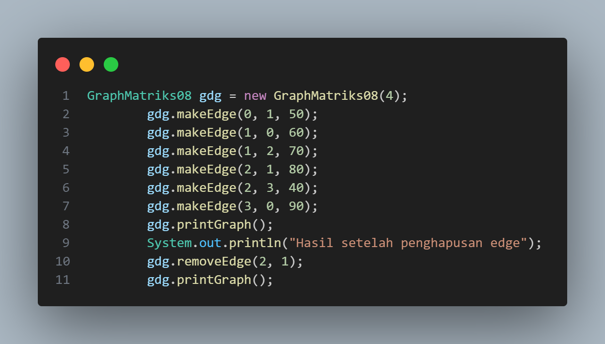

# Laporan Jobsheet XV Algoritma dan Struktur Data

    

Nama : Cindy Laili Larasati

NIM : 2341720038

<b>Praktikum 1</b>

Kode program :

    
    
    
    

Hasil Program :

    

Pertanyaan

1. Perbaiki kode program Anda apabila terdapat error atau hasil kompilasi kode tidak sesuai!

jawab : sudah

2. Pada class Graph, terdapat atribut list[] bertipe DoubleLinkedList. Sebutkan tujuan pembuatan
variabel tersebut!

jawab : array yang digunakan untuk menyimpan adjacency list dari graf. Setiap elemen dalam array ini merupakan sebuah linked list yang berisi semua node yang terhubung ke node tertentu. Tujuan dari pembuatan variabel ini adalah untuk memodelkan struktur data graf menggunakan adjacency list, yang merupakan salah satu metode yang efisien untuk menyimpan graf terutama ketika graf tersebut adalah graf jarang (sparse graph)

3. Jelaskan alur kerja dari method removeEdge!

jawab : 

 - Method ini menerima dua parameter, asal (source) dan tujuan (destination), yang menunjukkan edge mana yang akan dihapus

 - Method ini memanggil method remove pada adjacency list dari node asal, yang bertujuan untuk menghapus node tujuan dari daftar tetangga node asal

 - Jika graf adalah undirected (tidak berarah), biasanya method ini juga akan menghapus node asal dari daftar tetangga node tujuan, tetapi dalam implementasi yang diberikan hanya menghapus satu arah edge

4. Apakah alasan pemanggilan method addFirst() untuk menambahkan data, bukan method add
jenis lain saat digunakan pada method addEdge pada class Graph?

jawab : Efisiensi waktu dan pengimplementasian yang sederhana

5. Modifikasi kode program sehingga dapat dilakukan pengecekan apakah terdapat jalur antara
suatu node dengan node lainnya, seperti contoh berikut (Anda dapat memanfaatkan Scanner).

    

jawab : 

<b>Praktikum 2</b>

Kode program :

    
    

Hasil Program :

    

Pertanyaan

1. Perbaiki kode program Anda apabila terdapat error atau hasil kompilasi kode tidak sesuai!

jawab : sudah

2. Apa jenis graph yang digunakan pada Percobaan 2?

jawab : grap matriks bertipe array

3. Apa maksud dari dua baris kode berikut?

    

jawab : Dua baris kode tersebut bertujuan untuk menetapkan hubungan (edge) antara dua gedung dalam suatu graf. Baris pertama, gdg.makeEdge(1, 2, 70);, membuat edge dari gedung 1 ke gedung 2 dengan jarak 70 meter. Sementara baris kedua, gdg.makeEdge(2, 1, 80);, membuat edge dari gedung 2 ke gedung 1 dengan jarak 80 meter. Ini menunjukkan bahwa kedua gedung tersebut saling terhubung dalam graf, dan masing-masing memiliki jarak tertentu antara satu sama lain.

4. Modifikasi kode program sehingga terdapat method untuk menghitung degree, termasuk
inDegree dan outDegree!

jawab : 

<b>Latihan</b>

1. Modifikasi kode program pada class GraphMain sehingga terdapat menu program yang bersifat
dinamis, setidaknya terdiri dari:

a. Add Edge

b. Remove Edge

c. Degree

d. Print Graph

e. Cek Edge

Pengguna dapat memilih menu program melalui input Scanner

2. Tambahkan method updateJarak pada Percobaan 1 yang digunakan untuk mengubah jarak
antara dua node asal dan tujuan!

3. Tambahkan method hitungEdge untuk menghitung banyaknya edge yang terdapat di dalam graf!
