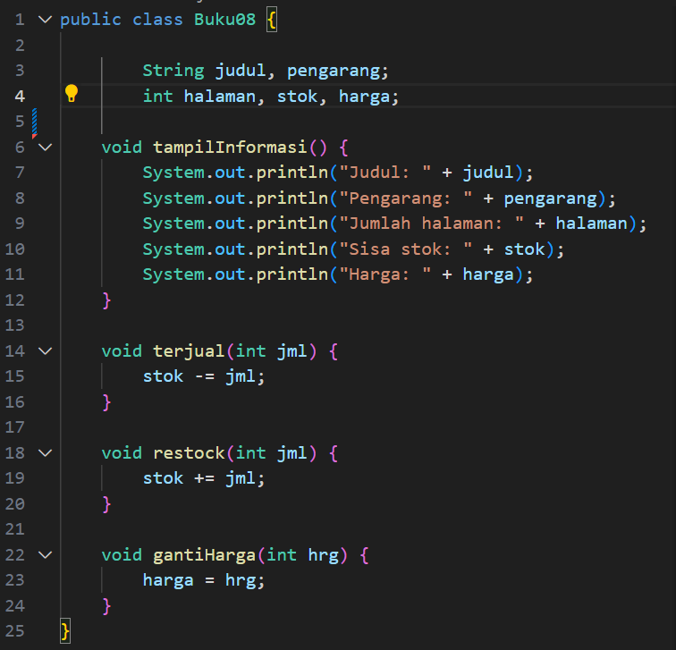
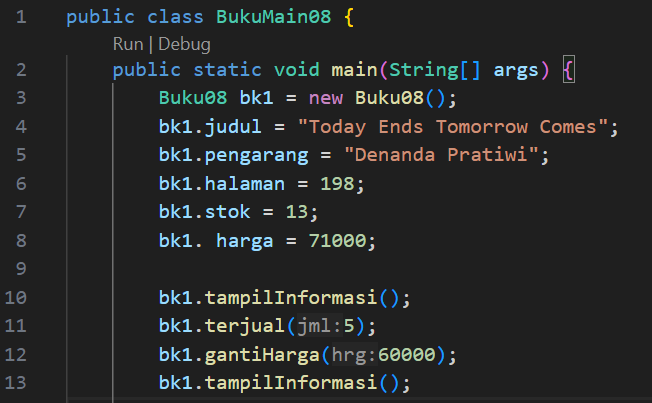
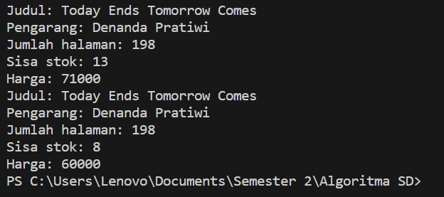
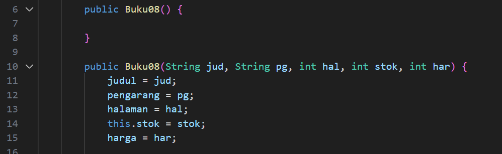
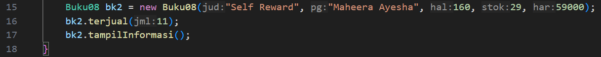

# Laporan Jobsheet II Algoritma dan Struktur Data

    

Nama : Cindy Laili Larasati

NIM : 2341720038

<b>Percobaan 1</b>

Kode program :

    

Hasil program :

    

Pertanyaan

1. Sebutkan dua karakteristik class atau object!

jawab : class merupakan konsep suatu objek yang bersifat umum, sedangkan objek merupakan implementasi dari class tersebut yang bersifat spesifik

2. Perhatikan class Buku pada Praktikum 1 tersebut, ada berapa atribut yang dimiliki oleh class
Buku? Sebutkan apa saja atributnya!

 jawab : ada 5 atribut yaitu judul, pengarang, halaman, stok, harga

Ada berapa method yang dimipki oleh class tersebut? Sebutkan apa saja methodnya!

3. Ada berapa method yang dimipki oleh class tersebut? Sebutkan apa saja methodnya!

jawab : ada 4 method yaitu tampil, terjual, restock, gantiHarga

4. Perhatikan method terjual() yang terdapat di dalam class Buku. Modifikasi isi method tersebut sehingga proses pengurangan hanya dapat dilakukan jika stok masih ada (lebih besar dari 0)!

jawab : 

5. Menurut Anda, mengapa method restock() mempunyai satu parameter berupa bilangan int?

jawab : agar ada nilai yang bisa di jumlahkan dengan stok

6. Commit dan push kode program ke Github

<b>Percobaan 2</b>

Kode program :

    

Hasil program :

    

Pertanyaan

1. Pada class BukuMain, tunjukkan baris kode program yang digunakan untuk proses instansiasi! Apa nama object yang dihasilkan?

 jawab : terletak pada baris ke 3 yaitu Buku15 bk1 = new Buku08();. objek yang dihasilkan adalah bk1

2. Bagaimana cara mengakses atribut dan method dari suatu objek?

jawab : dengan cara menyebutkan namaobjek.atribut (bk1.judul) lalu isi juga nilai yang sesuai dengan atribut

3. Mengapa hasil output pemanggilan method tampilInformasi() pertama dan kedua berbeda?

jawab : karena pada method tampilInformasi pertama yang ditampilkan adalah data yang sudah ditambah nilainya. tapi pada method tampilInformasi kedua telah dialakukan pemanggilan fungsi terjual maka akan mengurangi stok dan ganti harga yang mengubah nilai harga

<b>Percobaan 3</b>

Kode program :

    
    

Hasil program :

    

Pertanyaan

1. Pada class Buku di Percobaan 3, tunjukkan baris kode program yang digunakan untuk mendeklarasikan konstruktor berparameter!

jawab : pada baris ke 10 yaitu  public Buku08(String jud, String pg, int hal, int stok, int har) {}

2. Perhatikan class BukuMain. Apa sebenarnya yang dilakukan pada baris program berikut?

jawab :  instansiasi objek dengan mengakses atribut objek melalui konstruktor berparameter dan memberi nilai atribut pada konstruktor berparameter

3. Hapus konstruktor default pada class Buku, kemudian compile dan run program. Bagaimana hasilnya? Jelaskan mengapa hasilnya demikian!

jawab : Akan terjadi error pada instansiasi objek yang menggunakan konstruktor default, karena saat instansiasi tersebut tidak ada parameter dalam konstruktor buku yang sesuai pada class buku

4. Setelah melakukan instansiasi object, apakah method di dalam class Buku harus diakses secara berurutan? Jelaskan alasannya!

jawab : Tidak, karena method adalah hal hal yang bisa dilakukan oleh objek dan pemrogrmanan berbasis objek tidak bersifat struktural jadi pemanggilan method bebas seperti pada contoh pemanggilan informasi buku setelah merubah harga

5. Buat object baru dengan nama buku menggunakan konstruktor berparameter dari class Buku!

jawab : Buku15 bkInnama = new Buku15("Biografi Innama Maesa", "Innama Maesa", 100, 50, 73000);
dan jika ingin menampilkan objek tersebut bisa dipanggil dengan menggunakan bkInnama.tampilInformasi();

<b>Latihan</b>

1. Membuat method baru pada class Buku

Kode Program : 

Hasil Program : 

1. Membuat method baru pada class Buku

Kode Program : 

Hasil Program : 

