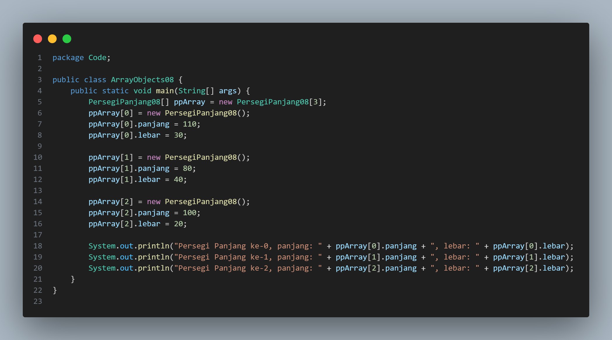
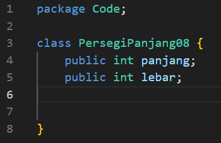
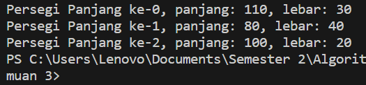

# Laporan Jobsheet III Algoritma dan Struktur Data

    

Nama : Cindy Laili Larasati

NIM : 2341720038

<b>Percobaan 1</b>

Kode program :

    
    

Hasil Program :

    

Pertanyaan

1. Berdasarkan uji coba 3.2, apakah class yang akan dibuat array of object harus selalu memiliki
atribut dan sekaligus method?Jelaskan!

jawab : tidak karena Class tanpa atribut atau method masih bisa dibuat dan digunakan dalam array of object, tergantung kebutuhan dan fungsinya.

2. Apakah class PersegiPanjang memiliki konstruktor?Jika tidak, kenapa dilakukan pemanggilan
konstruktur pada baris program berikut :

ppArray[1] = new PersegiPanjang();

jawab : karena butuh konstruktor dalam intansiasi objek

3. Apa yang dimaksud dengan kode berikut ini:

PersegiPanjang[] ppArray = new PersegiPanjang[3]

jawab : intansiasi array

4. Apa yang dimaksud dengan kode berikut ini:

ppArray[1] = new PersegiPanjang()

ppArray[1].panjang = 80;

ppArray[1].lebar = 40;

jawab : pemanggilan atribut

5. Mengapa class main dan juga class PersegiPanjang dipisahkan pada uji coba 3.2?

jawab : agar lebih terstruktur dan kodenya lebih rapi

<b>Percobaan 2</b>

Kode program :

Hasil Program :

Pertanyaan

<b>Percobaan 3</b>

Kode program :

Hasil Program :

Pertanyaan
