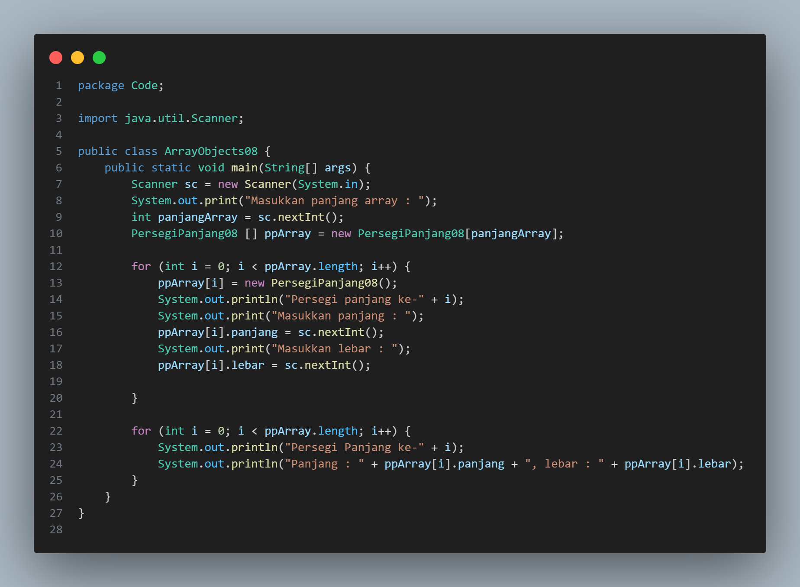
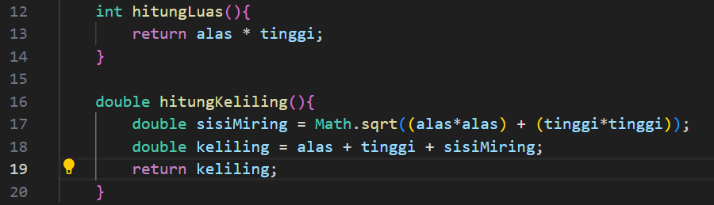

# Laporan Jobsheet III Algoritma dan Struktur Data

    

Nama : Cindy Laili Larasati

NIM : 2341720038

<b>Percobaan 1</b>

Kode program :

    
    

Hasil Program :

    

Pertanyaan

1. Berdasarkan uji coba 3.2, apakah class yang akan dibuat array of object harus selalu memiliki
atribut dan sekaligus method?Jelaskan!

jawab : tidak karena Class tanpa atribut atau method masih bisa dibuat dan digunakan dalam array of object, tergantung kebutuhan dan fungsinya.

2. Apakah class PersegiPanjang memiliki konstruktor?Jika tidak, kenapa dilakukan pemanggilan
konstruktur pada baris program berikut :

ppArray[1] = new PersegiPanjang();

jawab : karena butuh konstruktor dalam intansiasi objek

3. Apa yang dimaksud dengan kode berikut ini:

PersegiPanjang[] ppArray = new PersegiPanjang[3]

jawab : intansiasi array

4. Apa yang dimaksud dengan kode berikut ini:

ppArray[1] = new PersegiPanjang()

ppArray[1].panjang = 80;

ppArray[1].lebar = 40;

jawab : pemanggilan atribut

5. Mengapa class main dan juga class PersegiPanjang dipisahkan pada uji coba 3.2?

jawab : agar lebih terstruktur dan kodenya lebih rapi

<b>Percobaan 2</b>

Kode program :

    

Hasil Program :

    

Pertanyaan

1. Apakah array of object dapat diimplementasikan pada array 2 Dimensi?

jawab : iya

2. Jika jawaban soal no satu iya, berikan contohnya! Jika tidak, jelaskan!

jawab : nama dan umur yang dipisahkan dengan baris

3. Jika diketahui terdapat class Persegi yang memiliki atribut sisi bertipe integer, maka kode
dibawah ini akan memunculkan error saat dijalankan. Mengapa?

Persegi[] pgArray = new Persegi[100];

pgArray[5].sisi = 20;

jawab : karena belum di instansiasi objeknya

4. Modifikasi kode program pada praktikum 3.3 agar length array menjadi inputan dengan Scanner!

jawab : 

    
    

5. Apakah boleh Jika terjadi duplikasi instansiasi array of objek, misalkan saja instansiasi dilakukan
pada ppArray[i] sekaligus ppArray[0]?Jelaskan !

jawab :boleh, tapi nilainya akan tertumpuk

<b>Percobaan 3</b>

Kode program :

    

Hasil Program :

    

Pertanyaan

1. Dapatkah konstruktor berjumlah lebih dalam satu kelas? Jelaskan dengan contoh!

jawab : bisa, contohnya konstruktor yang berparameter dan yang tidak berparameter

2. Jika diketahui terdapat class Segitiga seperti berikut ini:

public class Segitiga

public int alas;

public int tinggi;

Tambahkan konstruktor pada class Segitiga tersebut yang berisi parameter int a, int t
yang masing-masing digunakan untuk mengisikan atribut alas dan tinggi.

jawab : 

    
    

3. Tambahkan method hitungLuas() dan hitungKeliling() pada class Segitiga
tersebut. Asumsi segitiga adalah segitiga siku-siku. (Hint: Anda dapat menggunakan bantuan
library Math pada Java untuk mengkalkulasi sisi miring)

jawab : 

    

4. Pada fungsi main, buat array Segitiga sgArray yang berisi 4 elemen, isikan masing-masing
atributnya sebagai berikut:

sgArray ke-0 alas: 10, tinggi: 4

sgArray ke-1 alas: 20, tinggi: 10

sgArray ke-2 alas: 15, tinggi: 6

sgArray ke-3 alas: 25, tinggi: 10

jawab :

    

5. Kemudian menggunakan looping, cetak luas dan keliling dengan cara memanggil method
hitungLuas() dan hitungKeliling().

jawab : 

    

<b>Latihan</b>

1. Menghitung Luas permukaan dan Volumen bangun ruang

Kerucut

jawab : 

    

Limas

jawab : 

    

Bola

jawab : 

    

Kode class main

jawab : 

    

2. Sebuah kampus membutuhkan program untuk menampilkan informasi mahasiswa berupa nama,
nim, jenis kelamin dan juga IPK mahasiswa. Program dapat menerima input semua informasi
tersebut, kemudian menampilkanya kembali ke user. Implementasikan program tersebut jika
dimisalkan terdapat 3 data mahasiswa yang tersedia.

jawab : 

Kode program :

    
    

Hasil Program :

    

3. Modifikasi program Latihan no.2 di atas, sehingga bisa digunakan untuk menghitung rata-rata IPK,
serta menampilkan data mahasiswa dengan IPK terbesar! (gunakan method untuk masing-masing
proses tersebut)

jawab : 

    
    

Hasil Program :

    