# Laporan Jobsheet V Algoritma dan Struktur Data

    

Nama : Cindy Laili Larasati

NIM : 2341720038

<b>Percobaan 1</b>

Kode program :

    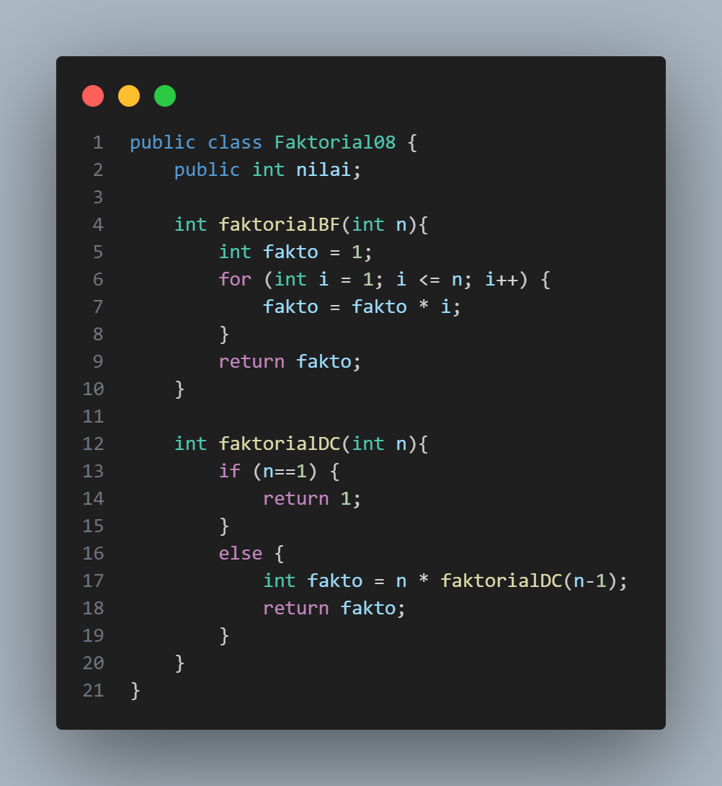
    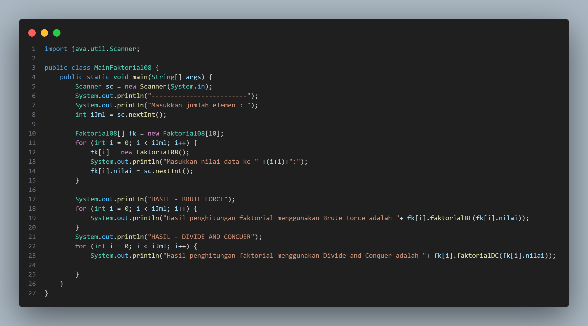

Hasil Program :

    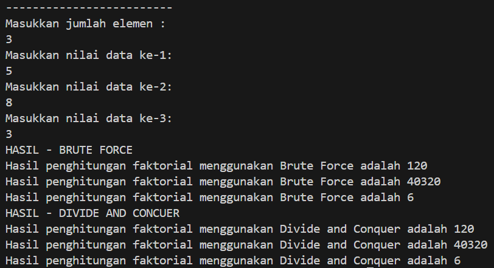

Pertanyaan

1. Pada base line Algoritma Divide Conquer untuk melakukan pencarian nilai faktorial, jelaskan
perbedaan bagian kode pada penggunaan if dan else!

jawab : if menentukan kondisi batas dan menghentikan rekursi sedangkan else memecah masalah dan melanjutkan rekursi

2. Apakah memungkinkan perulangan pada method faktorialBF() dirubah selain menggunakan
for?Buktikan!

jawab : perulangan dapat di gantikan dengan menggunakan perluangan while

3. Jelaskan perbedaan antara fakto *= i; dan int fakto = n * faktorialDC(n-1); !

jawab : Pada fakto *= i dilakukan operasi assignment dalam iterasi namun pada fakto = n * faktorialDC(n-1) dilakukan proses rekursif

<b>Percobaan 2</b>

Kode program :

    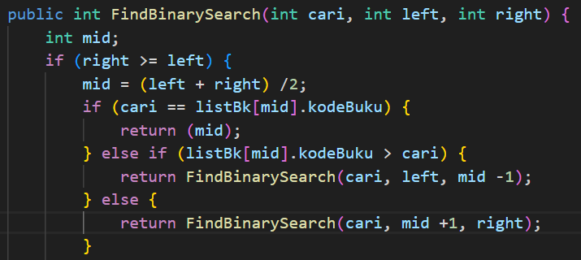
    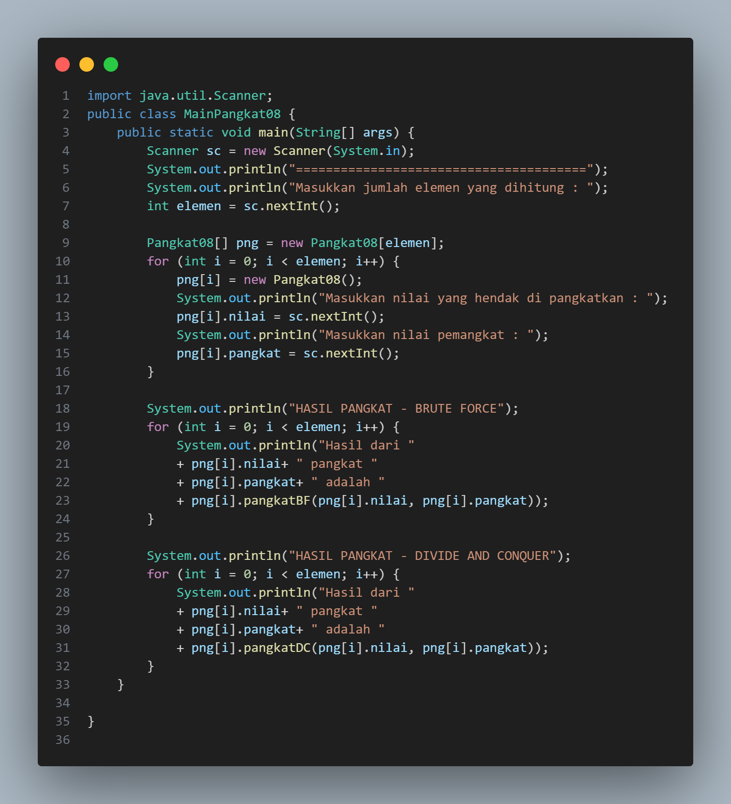

Hasil Program :

    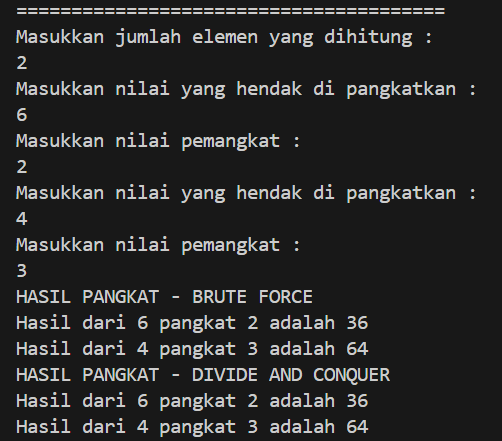

Pertanyaan

1. Jelaskan mengenai perbedaan 2 method yang dibuat yaitu PangkatBF() dan PangkatDC()!

jawab : method PangkatBF merupakan perhitungan pangkat yang menggunakan algoritma Brute Force dengan menerapkan perhitungan per indeks pada perulangan. pada method PangkatDC menggunakan algortima Divide Conquer yang membagi tiap bagian pangkat kemudian di hitung per bagian kemudian di combine

2. Apakah tahap combine sudah termasuk dalam kode tersebut?Tunjukkan!

jawab : Terdapat dalam method PangkatDC di bagian rekursif berikut :

 if(n%2==1) { // bilangan ganjil 
    return (pangkatDC(a,n/2)*pangkatDC(a,n/2)*a);
    } else {
        return (pangkatDC(a,n/2)*pangkatDC(a,n/2));
    }

3. Modifikasi kode program tersebut, anggap proses pengisian atribut dilakukan dengan
konstruktor.

jawab :

4. Tambahkan menu agar salah satu method yang terpilih saja yang akan dijalankan menggunakan
switch-case!

jawab :

<b>Percobaan 3</b>

Kode program :

    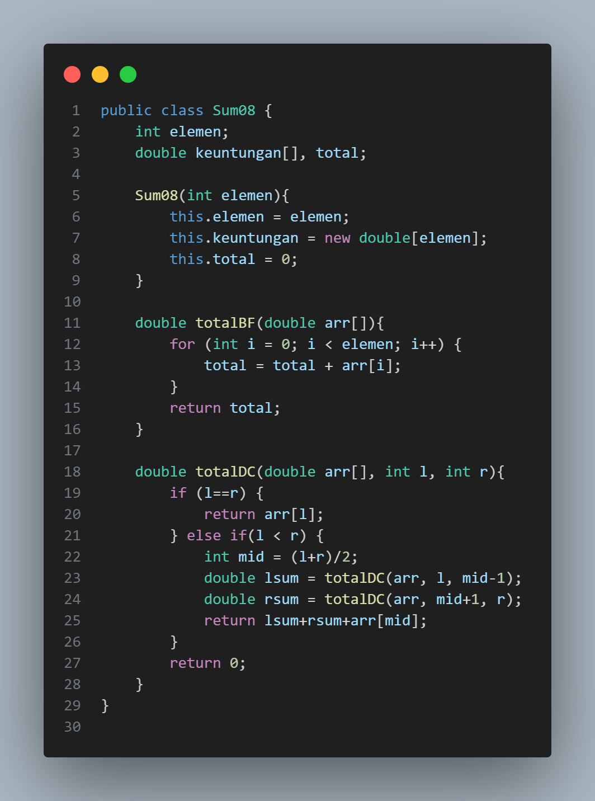
    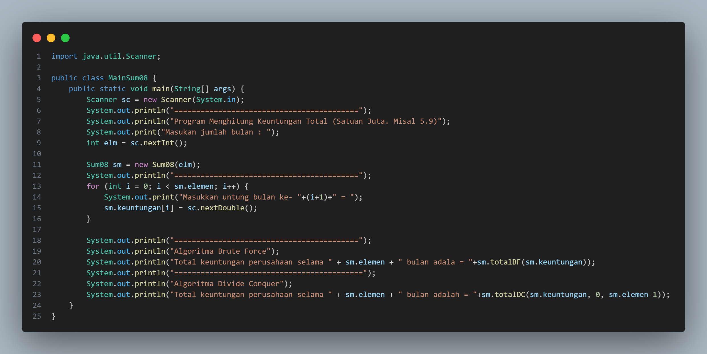

Hasil Program :

    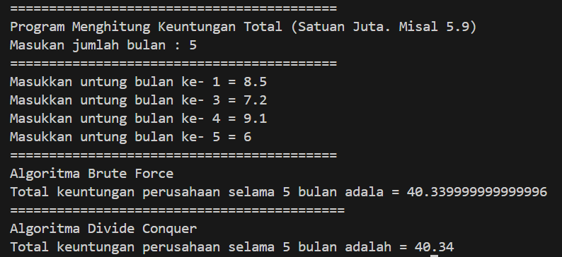

Pertanyaan

1. Mengapa terdapat formulasi return value berikut?Jelaskan!

jawab : untuk menggabungkan hasil penjumlahan sisi kiri (lsum), sisi kanan (rsum), dan bagian tengah (arr[mid])

2. Kenapa dibutuhkan variable mid pada method TotalDC()?

jawab : untuk membagi array menjadi dua bagian sama panjang

3. Program perhitungan keuntungan suatu perusahaan ini hanya untuk satu perusahaan saja.
Bagaimana cara menghitung sekaligus keuntungan beberapa bulan untuk beberapa
perusahaan.(Setiap perusahaan bisa saja memiliki jumlah bulan berbeda-beda)? Buktikan
dengan program!

jawab :

    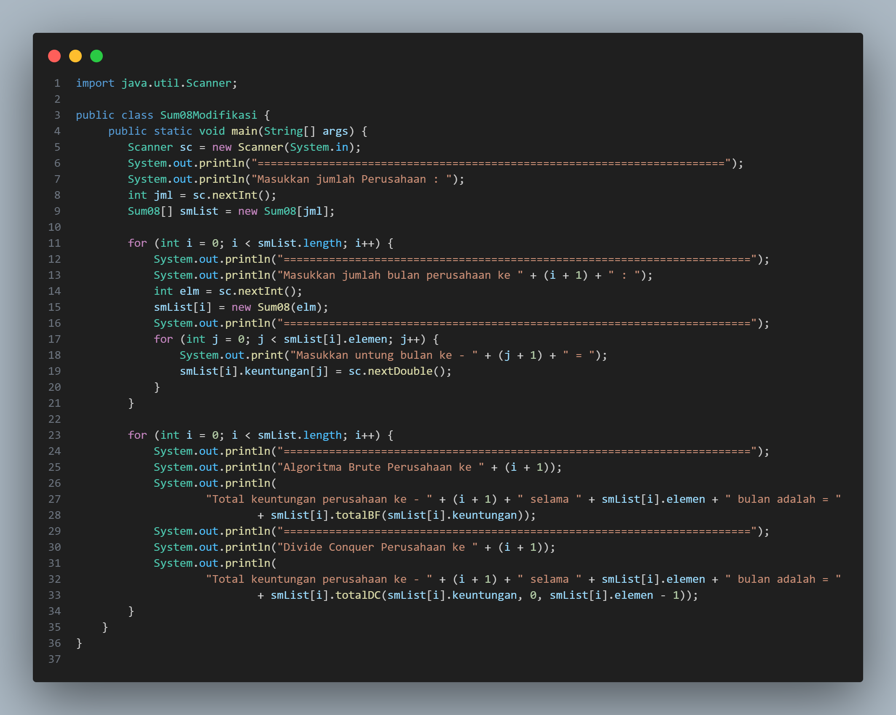

<b>Latihan</b>

1. Sebuah showroom memiliki daftar mobil dengan data sesuai tabel di bawah ini

    

Tentukan:

a. top_acceleration tertinggi menggunakan Divide and Conquer!

b. top_acceleration terendah menggunakan Divide and Conquer!

c. Rata-rata top_power dari seluruh mobil menggunakan Brute Force!

jawab :

    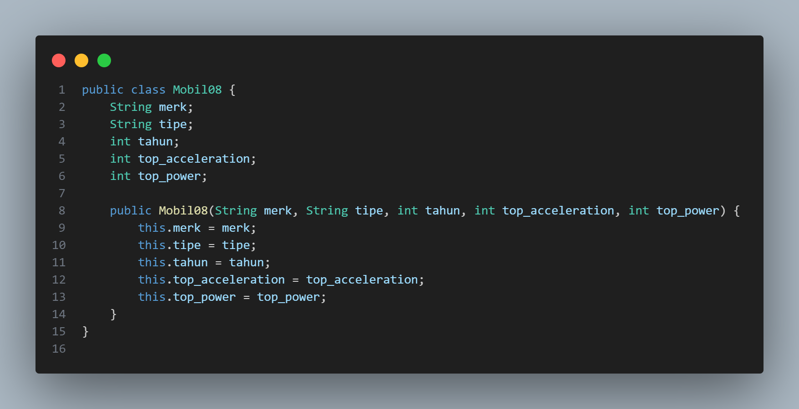
    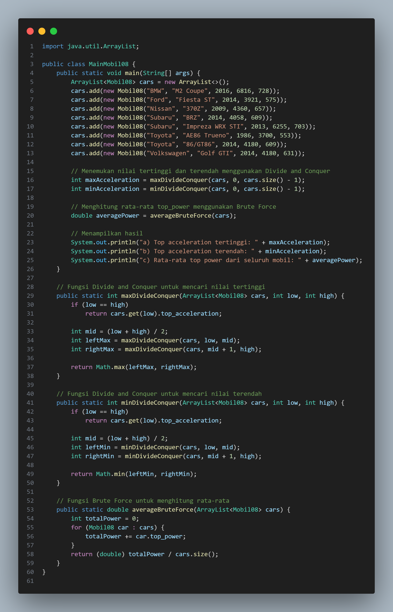

