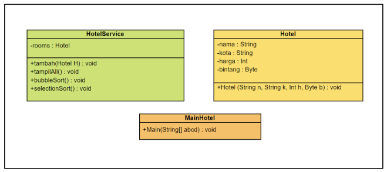
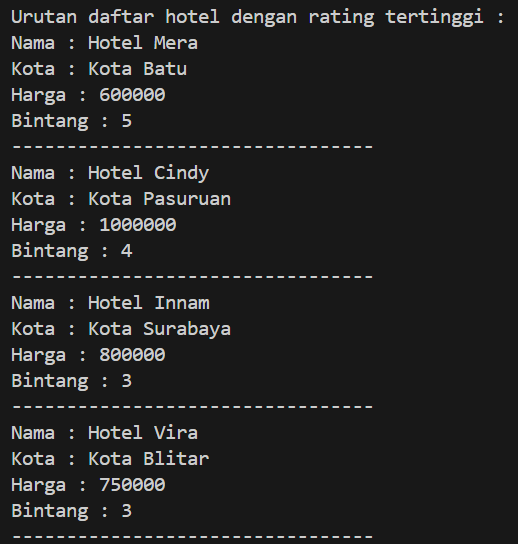

# Laporan Jobsheet VI Algoritma dan Struktur Data

    

Nama : Cindy Laili Larasati

NIM : 2341720038

<b>Percobaan 1</b>

Kode program :

    
    
    

Hasil Program :

    
    

Pertanyaan

1. Terdapat di method apakah proses bubble sort?

jawab : pada method bubbleSort() di class MahasiswaBerprestasi

2. Di dalam method bubbleSort(), terdapat baris program seperti di bawah ini:

Untuk apakah proses tersebut?

jawab : untuk mengurutkan objek berdasarkan nilai ipk dari terbesar sampai terkecil dengan membandingkan antara objek di suatu index dengan objek di index sebelumnya.

3. Perhatikan perulangan di dalam bubbleSort() di bawah ini:

a. Apakah perbedaan antara kegunaan perulangan i dan perulangan j?

jawab : Perulangan i: Digunakan untuk mengiterasi setiap elemen dalam array listMhs. Perulangan ini memastikan bahwa semua elemen dibandingkan dengan elemen di sebelahnya. Perulangan j: Digunakan untuk mengontrol berapa kali perbandingan dan penukaran elemen dilakukan. Perulangan ini berhenti ketika tidak ada lagi elemen yang perlu ditukar, yaitu ketika array sudah terurut.

b. Mengapa syarat dari perulangan i adalah i < listMhs.length-1 ? 

jawab :Syarat ini memastikan bahwa perulangan i tidak mengakses elemen di luar array. Elemen terakhir dalam array memiliki indeks listMhs.length-1, sehingga perulangan harus berhenti sebelum mencapai indeks tersebut.

c. Mengapa syarat dari perulangan j adalah j < listMhs.length-i ?

jawab : Syarat ini memastikan bahwa perbandingan dan penukaran elemen hanya dilakukan pada elemen-elemen yang belum terurut. Elemen-elemen yang berada di akhir array sudah terurut setelah perulangan sebelumnya, sehingga tidak perlu dibandingkan lagi.

d. Jika banyak data di dalam listMhs adalah 50, maka berapakali perulangan i akan berlangsung? Dan ada berapa Tahap bubble sort yang ditempuh?

jawab : Perulangan i akan berlangsung sebanyak 50 - 1 = 49 kali.

Jumlah tahap bubble sort tidak dapat ditentukan secara pasti. Tahap bubble sort akan berhenti ketika array sudah terurut. Dalam kasus terburuk, bubble sort membutuhkan listMhs.length - 1 tahap untuk mengurutkan seluruh elemen. Dalam kasus ini, bubble sort membutuhkan 49 tahap untuk mengurutkan seluruh elemen.

<b>Percobaan 2</b>

Kode program :

    

Hasil Program :

    
    

Pertanyaan

Di dalam method selection sort, terdapat baris program seperti di bawah ini:

Untuk apakah proses tersebut, jelaskan!

jawab : untuk mencari nilai ipk terkecil dari array listMhs dengan membandingkan antar index array 

<b>Percobaan 3</b>

Kode program :

    

Hasil Program :

    
    

Pertanyaan

Ubahlah fungsi pada InsertionSort sehingga fungsi ini dapat melaksanakan proses sorting
dengan cara descending.

jawab :

    

<b>Latihan</b>

Sebuah platform travel yang menyediakan layanan pemesanan kebutuhan travelling sedang
mengembangkan backend untuk sistem pemesanan/reservasi akomodasi (penginapan), salah
satu fiturnya adalah menampilkan daftar penginapan yang tersedia berdasarkan pilihan filter
yang diinginkan user. Daftar penginapan ini harus dapat disorting berdasarkan 

1. Harga dimulai dari harga termurah ke harga tertinggi. 

2. Rating bintang penginapan dari bintang tertinggi (5) ke terendah (1) 

Buatlah proses sorting data untuk kedua filter tersebut dengan menggunakan algoritma
bubble sort dan selection sort.

    

Jawab :

    
    
    

