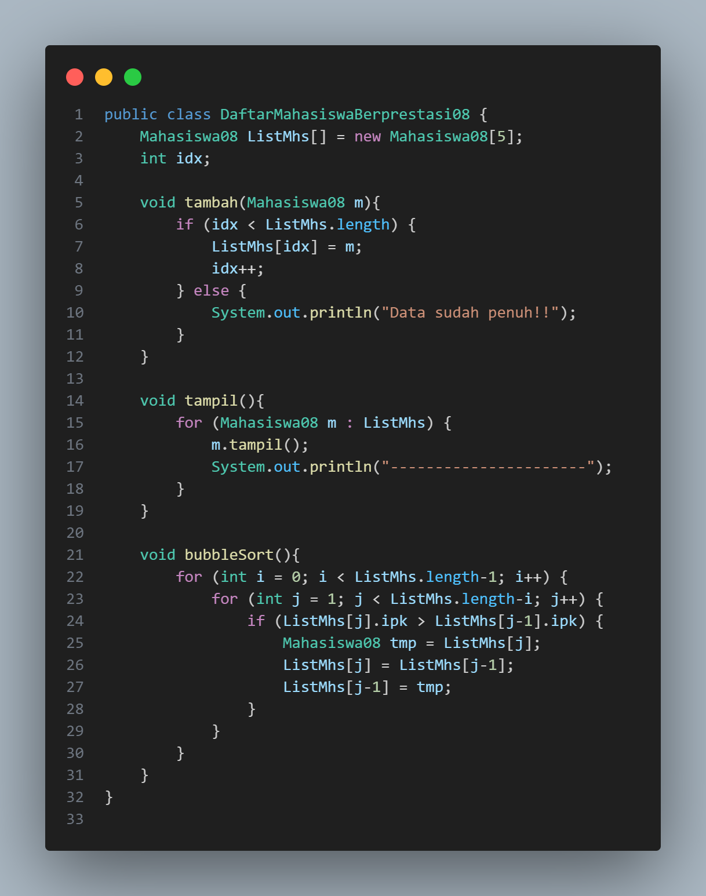
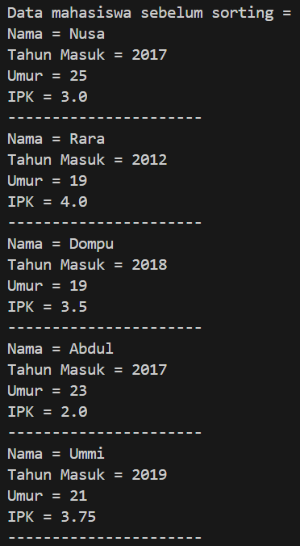
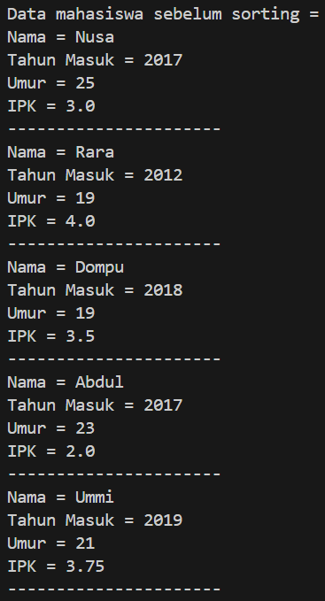

# Laporan Jobsheet VI Algoritma dan Struktur Data

    

Nama : Cindy Laili Larasati

NIM : 2341720038

<b>Percobaan 1</b>

Kode program :

    
    
    

Hasil Program :

    
    

Pertanyaan

1. Terdapat di method apakah proses bubble sort?

jawab :

2. Di dalam method bubbleSort(), terdapat baris program seperti di bawah ini:

Untuk apakah proses tersebut?

jawab :

3. Perhatikan perulangan di dalam bubbleSort() di bawah ini:

a. Apakah perbedaan antara kegunaan perulangan i dan perulangan j?

b. Mengapa syarat dari perulangan i adalah i < listMhs.length-1 ? 

c. Mengapa syarat dari perulangan j adalah j < listMhs.length-i ?

d. Jika banyak data di dalam listMhs adalah 50, maka berapakali perulangan i akan berlangsung? Dan ada berapa Tahap bubble sort yang ditempuh?

jawab :

<b>Percobaan 2</b>

Kode program :

    

Hasil Program :

    
    

Pertanyaan

Di dalam method selection sort, terdapat baris program seperti di bawah ini:

Untuk apakah proses tersebut, jelaskan!

jawab :

<b>Percobaan 3</b>

Kode program :

    

Hasil Program :

    
    

Pertanyaan

Ubahlah fungsi pada InsertionSort sehingga fungsi ini dapat melaksanakan proses sorting
dengan cara descending.

jawab :
