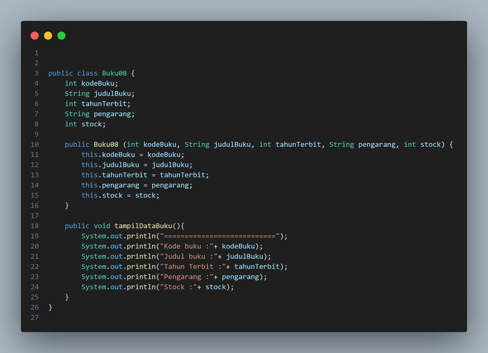
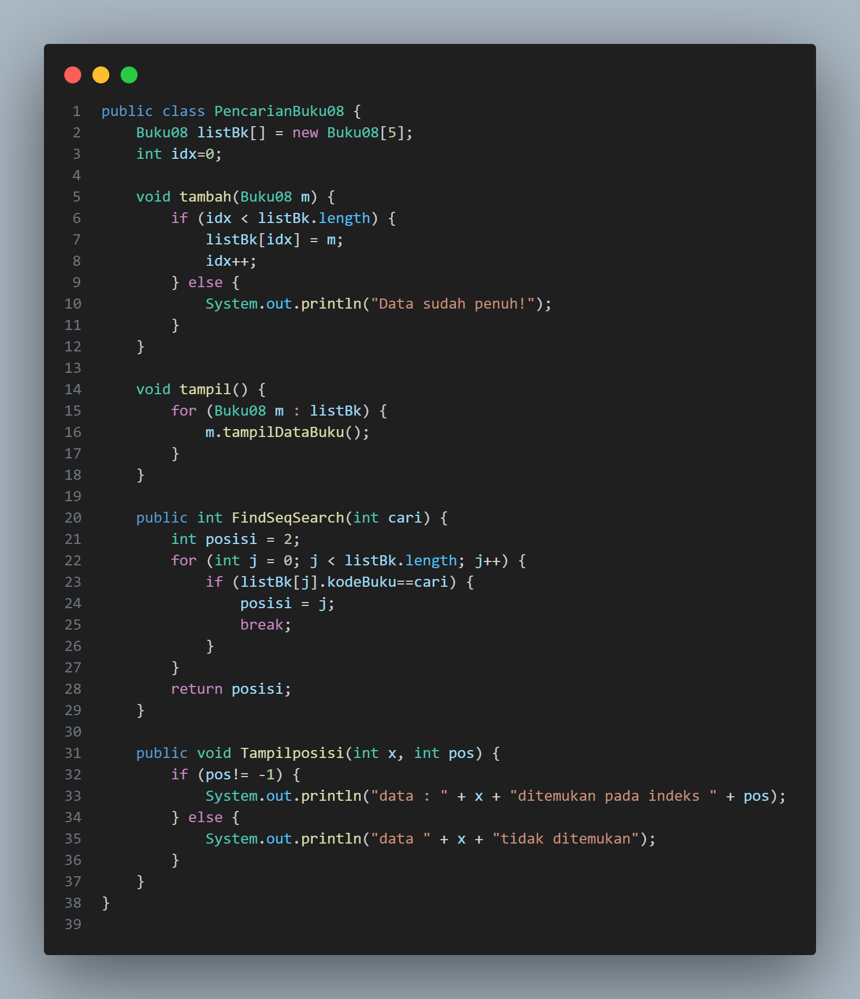
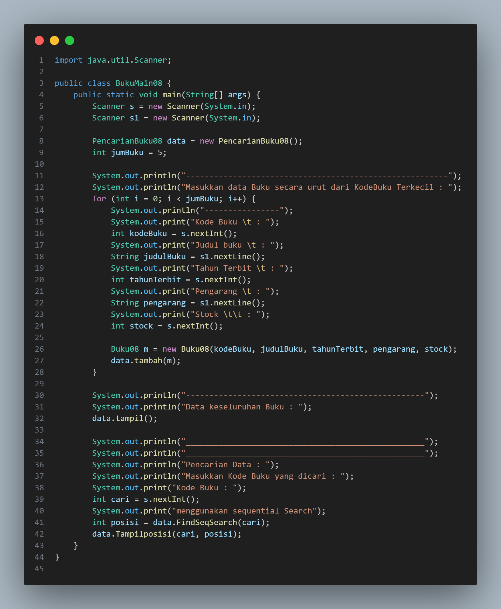
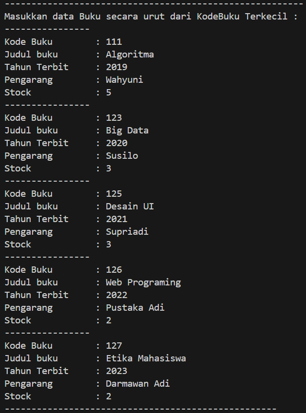
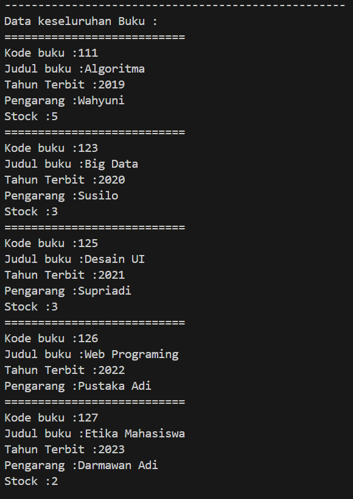
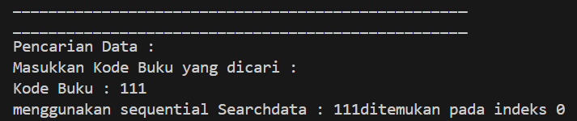
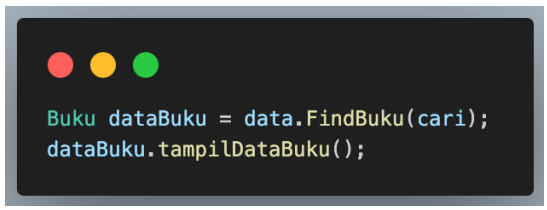

# Laporan Jobsheet VII Algoritma dan Struktur Data

    

Nama : Cindy Laili Larasati

NIM : 2341720038

<b>Percobaan 1</b>

Kode program :

    
    
    

Hasil Program :

    
    
    
    

Pertanyaan

1. Jelaskan fungsi break yang ada pada method FindSeqSearch!

jawab : 

2. Jika Data Kode Buku yang dimasukkan tidak terurut dari kecil ke besar. Apakah program masih
dapat berjalan? Apakah hasil yang dikeluarkan benar? Tunjukkan hasil screenshoot untuk bukti
dengan kode Buku yang acak. Jelaskan Mengapa hal tersebut bisa terjadi?

jawab :

3. Buat method baru dengan nama FindBuku menggunakan konsep sequential search dengan tipe
method dari FindBuku adalah BukuNoAbsen. Sehingga Anda bisa memanggil method
tersebut pada class BukuMain seperti gambar berikut :

    

