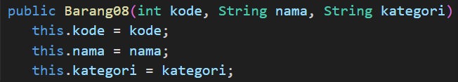
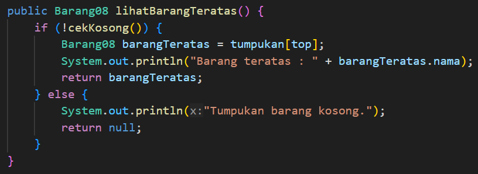
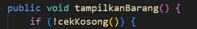
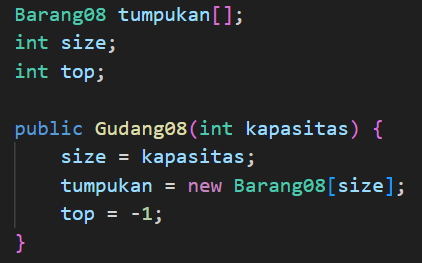
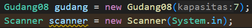
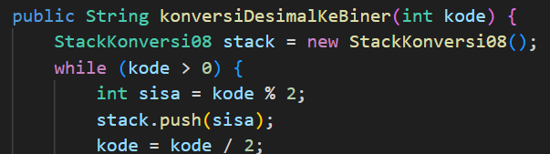
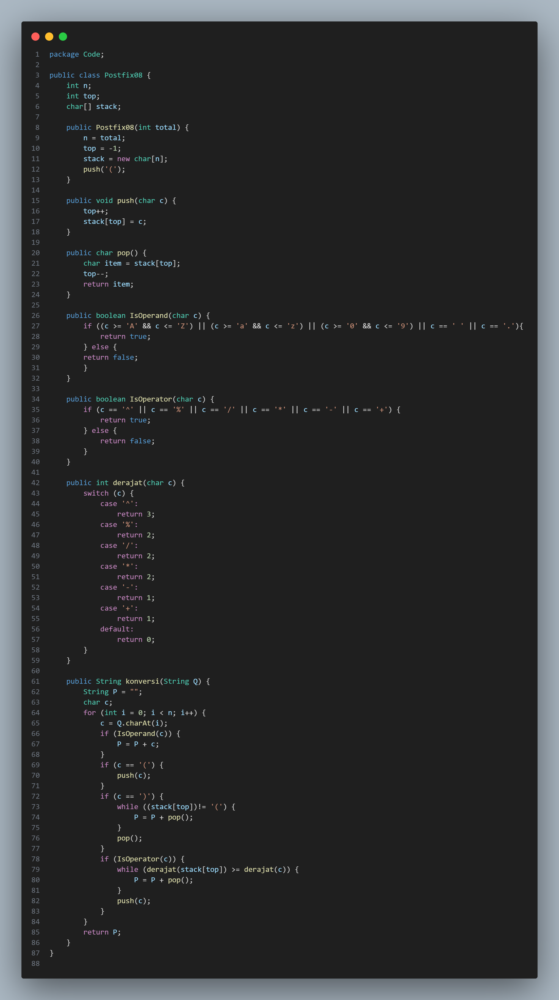
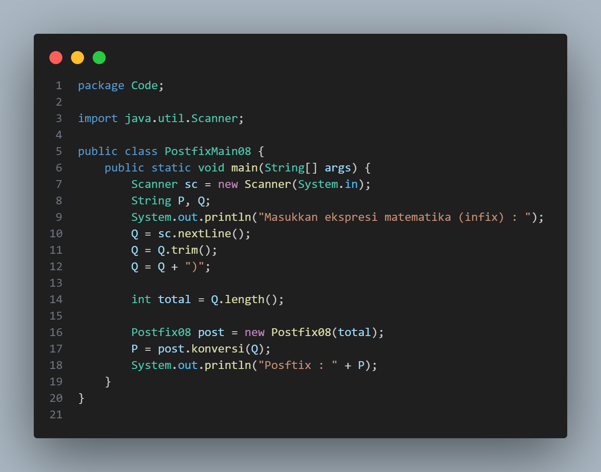
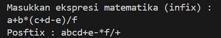

# Laporan Jobsheet VIII Algoritma dan Struktur Data

    

Nama : Cindy Laili Larasati

NIM : 2341720038

<b>Percobaan 1</b>

Kode program :

    
    
    

Hasil Program :

    
    

Pertanyaan

1. Lakukan perbaikan pada kode program, sehingga keluaran yang dihasilkan sama dengan verifikasi
hasil percobaan! Bagian mana saja yang perlu diperbaiki?

jawab : 

    
    
    

2. Berapa banyak data barang yang dapat ditampung di dalam tumpukan? Tunjukkan potongan kode
programnya!

jawab : 

    

3. Mengapa perlu pengecekan kondisi !cekKosong() pada method tampilkanBarang? Kalau kondisi
tersebut dihapus, apa dampaknya?

jawab : karena untuk memastikan bahwa tumpukan barang tidak kososng sebelum mencoba menampilkan isinya. jika kondisi ini dihapus, maka akan terjadi kesalhan saat mencoba mengakses elemen dari tumpukan barang yang kosong, yang dapat menyebabkan program berhenti secara paksa saat di run.

4. Modifikasi kode program pada class Utama sehingga pengguna juga dapat memilih operasi lihat
barang teratas, serta dapat secara bebas menentukan kapasitas gudang!

jawab : 

    

<b>Percobaan 2</b>

Kode program :

    

Hasil Program :

    

Pertanyaan

1. Pada method konversiDesimalKeBiner, ubah kondisi perulangan menjadi while (kode != 0),
bagaimana hasilnya? Jelaskan alasannya!

jawab : 

Kode program :

    

2. Jelaskan alur kerja dari method konversiDesimalKeBiner!

jawab : mengonversi bilangan desimal menjadi biner menggunakan stack. dilakukan dengan membagi bilangan desimal dengan 2 secara berulang, dan menyimpan sisa pembagian dalam stack, kemudian mengeluarkan sisa sisa tersebut dari stack dan membentuk string biner

<b>Percobaan 3</b>

Kode program :

    
    

Hasil Program :

    

Pertanyaan

1. Pada method derajat, mengapa return value beberapa case bernilai sama? Apabila return
value diubah dengan nilai berbeda-beda setiap case-nya, apa yang terjadi?

jawab : yang terjadi adalah urutan operator yang dihasilkan dalam ekspresi positif dapat berubah sesuai dengan prioritas yang ditentukan dalam method derajat

2. Jelaskan alur kerja method konversi!

jawab : mengonversi ekspresi matematika dalam bentuk infix menjadi bentuk posfix

3. Pada method konversi, apa fungsi dari potongan kode berikut?

 c = Q.chartAt(i)

jawab : langkah untuk mengambil karakter berdasarkan indeks dalam string Q pada setiap iterasi loop

<b>Latihan</b>

Perhatikan dan gunakan kembali kode program pada Percobaan 1. Tambahkan dua method berikut
pada class Gudang:

• Method lihatBarangTerbawah digunakan untuk mengecek barang pada tumpukan terbawah

• Method cariBarang digunakan untuk mencari ada atau tidaknya barang berdasarkan kode
barangnya atau nama barangnya
