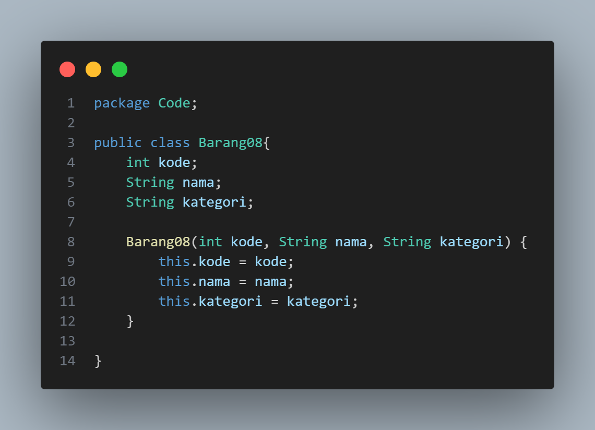
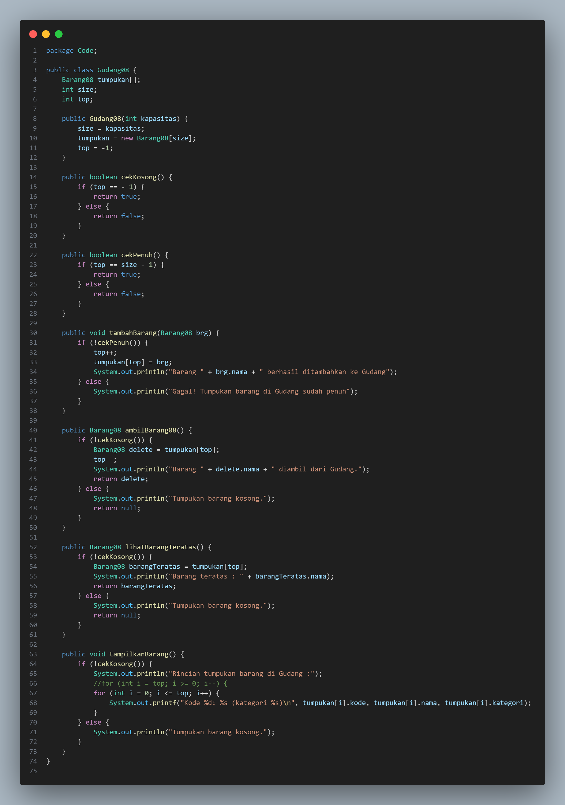
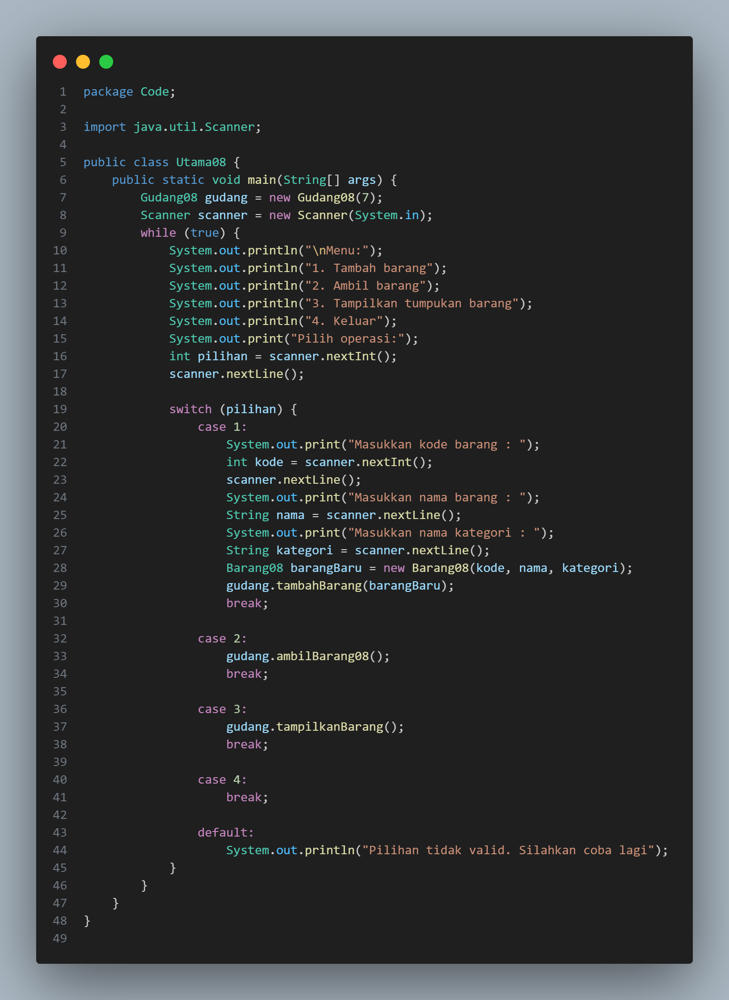
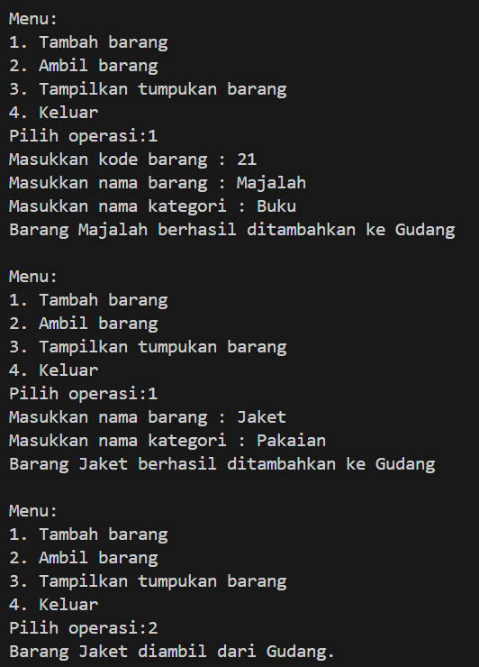
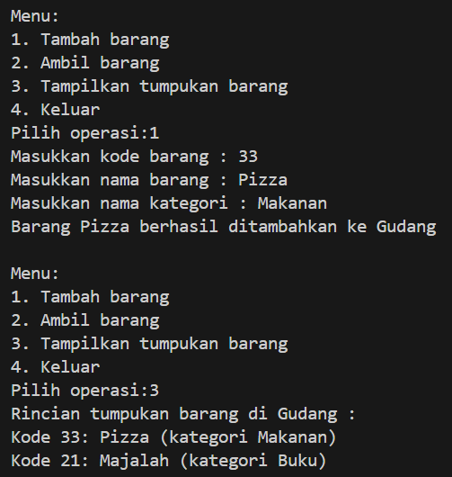
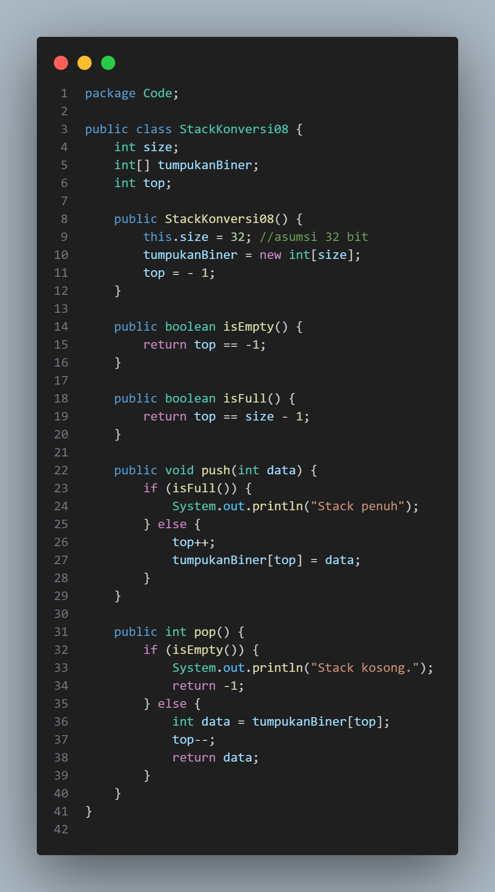
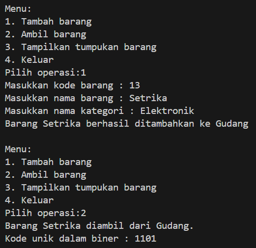

# Laporan Jobsheet VIII Algoritma dan Struktur Data

    

Nama : Cindy Laili Larasati

NIM : 2341720038

<b>Percobaan 1</b>

Kode program :

    
    
    

Hasil Program :

    
    

Pertanyaan

1. Lakukan perbaikan pada kode program, sehingga keluaran yang dihasilkan sama dengan verifikasi
hasil percobaan! Bagian mana saja yang perlu diperbaiki?

jawab : 

2. Berapa banyak data barang yang dapat ditampung di dalam tumpukan? Tunjukkan potongan kode
programnya!

jawab : 

3. Mengapa perlu pengecekan kondisi !cekKosong() pada method tampilkanBarang? Kalau kondisi
tersebut dihapus, apa dampaknya?

jawab : 

4. Modifikasi kode program pada class Utama sehingga pengguna juga dapat memilih operasi lihat
barang teratas, serta dapat secara bebas menentukan kapasitas gudang!

jawab : 

<b>Percobaan 2</b>

Kode program :

    

Hasil Program :

    

Pertanyaan

1. Pada method konversiDesimalKeBiner, ubah kondisi perulangan menjadi while (kode != 0),
bagaimana hasilnya? Jelaskan alasannya!

2. Jelaskan alur kerja dari method konversiDesimalKeBiner!
